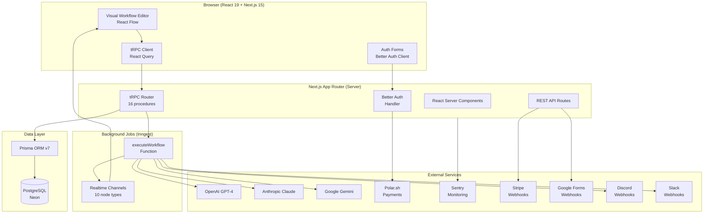

# NodeBase

> AI-powered workflow automation platform — build, connect, and execute intelligent pipelines through a visual node editor.

[](https://github.com/your-org/nodebase/actions/workflows/ci.yml)
[](./package.json)
[](./LICENSE)
[](https://nextjs.org)
[](https://www.typescriptlang.org)

---

## Overview

NodeBase is a full-stack AI automation platform that lets users design workflows using a visual drag-and-drop node editor. Workflows execute in sequence, passing data between nodes — AI models, HTTP requests, webhooks, and messaging integrations — with real-time status feedback powered by Inngest Realtime.

The platform is built for teams that need reliable, observable, and secure automation pipelines without managing infrastructure.

---

## Features

- **Visual Workflow Editor** — Drag, drop, and connect nodes on an infinite canvas powered by React Flow
- **10 Node Types** — Triggers, AI models (OpenAI, Anthropic, Gemini), HTTP requests, Discord, Slack
- **Webhook Triggers** — Receive events from Stripe and Google Forms to kick off workflows
- **Real-time Execution** — Watch each node transition through loading → success / error states live
- **Encrypted Credentials** — API keys stored AES-encrypted in the database, decrypted only at runtime
- **Subscription Gating** — Premium features protected by Polar.sh subscription checks
- **Multi-provider Auth** — Email/password + GitHub + Google OAuth via Better Auth
- **Execution History** — Every run tracked with status, output, and error stack traces
- **Type-safe API** — End-to-end type safety with tRPC and Zod validation
- **Production Monitoring** — Sentry integration for error tracking and performance

---

## Architecture Overview



---

## Tech Stack

| Layer | Technology | Version | Purpose |
|-------|-----------|---------|---------|
| Framework | Next.js | 15.5.4 | Full-stack React with App Router |
| Language | TypeScript | 5.x | End-to-end type safety |
| UI Library | React | 19.1.0 | Server and client components |
| Styling | Tailwind CSS | 4.x | Utility-first CSS |
| Component Primitives | Radix UI | Latest | Accessible headless components |
| Node Editor | React Flow (@xyflow/react) | 12.x | Visual workflow canvas |
| API Layer | tRPC | 11.6.0 | Type-safe server/client RPC |
| ORM | Prisma | 7.3.0 | Type-safe database access |
| Database | PostgreSQL (Neon) | Latest | Serverless Postgres |
| Job Queue | Inngest | 3.54.2 | Serverless workflow orchestration |
| Authentication | Better Auth | 1.3.28 | Sessions, OAuth, plugins |
| Payments | Polar.sh | 0.35.4 | Subscription billing |
| AI — OpenAI | @ai-sdk/openai | 2.x | GPT-4 integration |
| AI — Anthropic | @ai-sdk/anthropic | 2.x | Claude Sonnet integration |
| AI — Google | @ai-sdk/google | 2.x | Gemini Flash integration |
| Server State | React Query | 5.x | Data fetching and caching |
| Client State | Jotai | 2.x | Atomic state management |
| URL State | Nuqs | Latest | Type-safe URL search params |
| Encryption | Cryptr | 6.x | AES credential encryption |
| Monitoring | Sentry | 10.x | Error tracking |
| Linter/Formatter | Biome | 2.2.0 | Code quality |
| Release | Semantic Release | Latest | Automated versioning |

---

## Node Types

| Node | Category | Description |
|------|----------|-------------|
| `INITIAL` | Trigger | Default entry node (replaced on first selection) |
| `MANUAL_TRIGGER` | Trigger | Manually execute a workflow from the editor |
| `GOOGLE_FORM_TRIGGER` | Trigger | Receive Google Form submission via webhook |
| `STRIPE_TRIGGER` | Trigger | Receive Stripe event via webhook |
| `HTTP_REQUEST` | Action | Make an HTTP request to any external API |
| `GEMINI` | AI | Generate text using Google Gemini Flash |
| `OPENAI` | AI | Generate text using OpenAI GPT-4 |
| `ANTHROPIC` | AI | Generate text using Anthropic Claude Sonnet |
| `DISCORD` | Output | Send a message to a Discord channel via webhook |
| `SLACK` | Output | Send a message to a Slack channel via webhook |

---

## Prerequisites

- **Node.js** 20+
- **npm** 10+
- **PostgreSQL** database (or [Neon](https://neon.tech) account)
- **Inngest** account for workflow execution ([inngest.com](https://www.inngest.com))
- **Ngrok** for local OAuth/webhook callbacks (optional, for local development)

---

## Quickstart

### 1. Clone the repository

```bash
git clone https://github.com/your-org/nodebase.git
cd nodebase
```

### 2. Install dependencies

```bash
npm install
```

### 3. Configure environment variables

```bash
cp .env.example .env
```

Open `.env` and fill in the required values. At minimum you need:
- `DATABASE_URL` — PostgreSQL connection string
- `BETTER_AUTH_SECRET` — Random secret (`openssl rand -base64 32`)
- `BETTER_AUTH_URL` — Your app's base URL
- `ENCRYPTION_KEY` — 256-bit hex key (`openssl rand -hex 32`)

See [docs/ENVIRONMENT.md](docs/ENVIRONMENT.md) for the full variable reference.

### 4. Set up the database

```bash
npx prisma migrate dev
npx prisma generate
```

### 5. Start the development server

```bash
# Start everything (Next.js + Inngest dev server + Ngrok + Prisma Studio)
npm run dev:all

# Or start just Next.js
npm run dev
```

Open [http://localhost:3000](http://localhost:3000).

---

## Project Structure

```
nodebase/
├── prisma/
│   ├── schema.prisma              # Database schema (9 models)
│   └── migrations/                # 11 migration files
│
├── src/
│   ├── app/                       # Next.js 15 App Router
│   │   ├── (auth)/                # Auth pages (login, sign-up)
│   │   ├── (dashboard)/           # Main app with sidebar layout
│   │   │   ├── (editor)/          # Workflow editor canvas
│   │   │   └── (rest)/            # Workflows, credentials, executions list
│   │   └── api/                   # API route handlers
│   │       ├── auth/[...all]/     # Better Auth handler
│   │       ├── trpc/[trpc]/       # tRPC gateway
│   │       ├── inngest/           # Inngest webhook receiver
│   │       └── webhooks/          # Stripe + Google Form webhooks
│   │
│   ├── components/
│   │   ├── ui/                    # 50+ Radix UI primitive wrappers
│   │   ├── app-sidebar/           # Main navigation sidebar
│   │   ├── node-selector/         # Node type picker popup
│   │   └── react-flow/            # Custom React Flow components
│   │
│   ├── features/
│   │   ├── auth/                  # Login/register forms
│   │   ├── workflows/             # Workflow list and management
│   │   ├── credentials/           # API credential CRUD
│   │   ├── executions/            # Execution history + node executors
│   │   ├── editor/                # Visual workflow editor
│   │   ├── triggers/              # Trigger node executors + dialogs
│   │   └── subscriptons/          # Subscription status hooks
│   │
│   ├── inngest/
│   │   ├── client.ts              # Inngest instance with Realtime
│   │   ├── functions.ts           # executeWorkflow orchestrator
│   │   ├── channels/              # Real-time status channels (10 types)
│   │   └── utils/                 # topologicalSort, sendWorkflowExecution
│   │
│   ├── trpc/
│   │   ├── init.ts                # Context, procedures, middleware
│   │   ├── routers/_app.ts        # Root router
│   │   ├── client.tsx             # Client-side tRPC provider
│   │   └── server.tsx             # Server-side tRPC utilities
│   │
│   ├── lib/
│   │   ├── auth.ts                # Better Auth configuration
│   │   ├── auth-client.ts         # Client-side auth instance
│   │   ├── auth-utils.ts          # requireAuth / requireUnauth helpers
│   │   ├── db.ts                  # Prisma client singleton
│   │   ├── encryption.ts          # encrypt / decrypt with Cryptr
│   │   ├── polar.ts               # Polar.sh SDK client
│   │   └── utils.ts               # cn() className helper
│   │
│   ├── config/
│   │   ├── constants/             # Pagination defaults
│   │   └── node-components/       # NodeType → React component map
│   │
│   └── generated/
│       └── prisma/                # Generated Prisma client
│
├── .env.example                   # Environment variable template
├── next.config.ts                 # Next.js + Sentry configuration
├── prisma.config.ts               # Prisma configuration
├── biome.json                     # Linter/formatter configuration
├── mprocs.yaml                    # Multi-process dev runner
└── .releaserc.json                # Semantic release configuration
```

---

## Development Scripts

| Command | Description |
|---------|-------------|
| `npm run dev` | Start Next.js with Turbopack |
| `npm run dev:all` | Start all dev services (Next.js, Inngest, Ngrok, Prisma Studio) |
| `npm run build` | Production build with Turbopack |
| `npm run start` | Start production server |
| `npm run lint` | Run Biome linter |
| `npm run lint:fix` | Auto-fix lint issues |
| `npm run inngest:dev` | Start Inngest dev server only |
| `npx prisma studio` | Open Prisma Studio GUI |
| `npx prisma migrate dev` | Apply and generate new migration |
| `npx prisma generate` | Regenerate Prisma client |

---

## Documentation

| Document | Description |
|----------|-------------|
| [docs/ARCHITECTURE.md](docs/ARCHITECTURE.md) | System architecture, component diagrams, data flows |
| [docs/DATABASE.md](docs/DATABASE.md) | Database schema, ER diagram, migrations |
| [docs/API.md](docs/API.md) | Complete tRPC and REST API reference |
| [docs/WEBHOOKS.md](docs/WEBHOOKS.md) | External webhook endpoints and payloads |
| [docs/WORKFLOWS.md](docs/WORKFLOWS.md) | Workflow execution engine deep-dive |
| [docs/NODE_TYPES.md](docs/NODE_TYPES.md) | All 10 node types: config, behavior, examples |
| [docs/AUTHENTICATION.md](docs/AUTHENTICATION.md) | Auth system, OAuth, session lifecycle |
| [docs/CREDENTIALS.md](docs/CREDENTIALS.md) | Credential encryption and runtime usage |
| [docs/SUBSCRIPTIONS.md](docs/SUBSCRIPTIONS.md) | Polar.sh billing and subscription gates |
| [docs/ENVIRONMENT.md](docs/ENVIRONMENT.md) | All environment variables reference |
| [docs/DEPLOYMENT.md](docs/DEPLOYMENT.md) | Deploying to Vercel and self-hosted |
| [docs/DEVELOPMENT.md](docs/DEVELOPMENT.md) | Local development setup guide |
| [docs/MONITORING.md](docs/MONITORING.md) | Sentry, Inngest, observability |
| [docs/SECURITY_ARCH.md](docs/SECURITY_ARCH.md) | Security architecture and OWASP mapping |
| [docs/TROUBLESHOOTING.md](docs/TROUBLESHOOTING.md) | Common issues and debugging |
| [docs/adr/](docs/adr/) | Architecture Decision Records |
| [CONTRIBUTING.md](CONTRIBUTING.md) | How to contribute |
| [SECURITY.md](SECURITY.md) | Security policy and reporting |

---

## Contributing

See [CONTRIBUTING.md](CONTRIBUTING.md) for guidelines on submitting issues, pull requests, and commit message conventions.

---

## Security

For security vulnerabilities, see [SECURITY.md](SECURITY.md). Do not open public issues for security bugs.

---

## License

MIT — see [LICENSE](LICENSE) for details.
