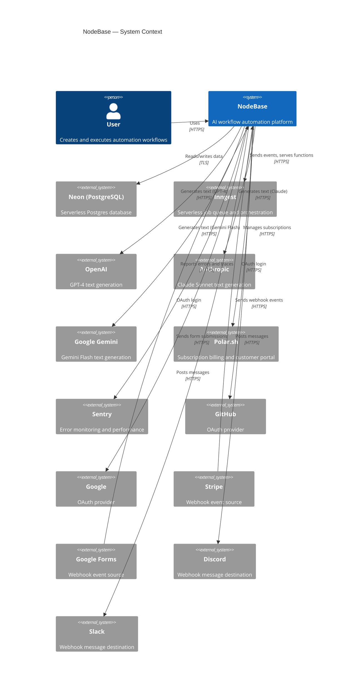
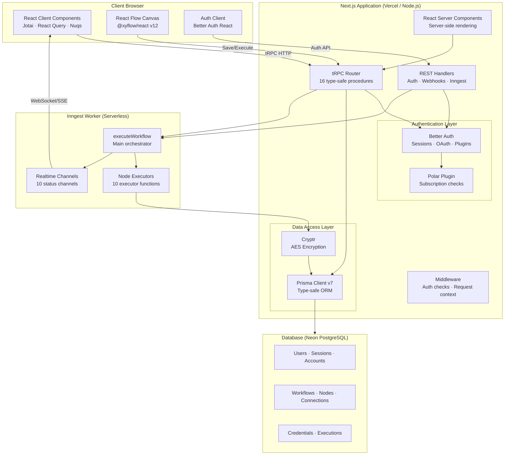
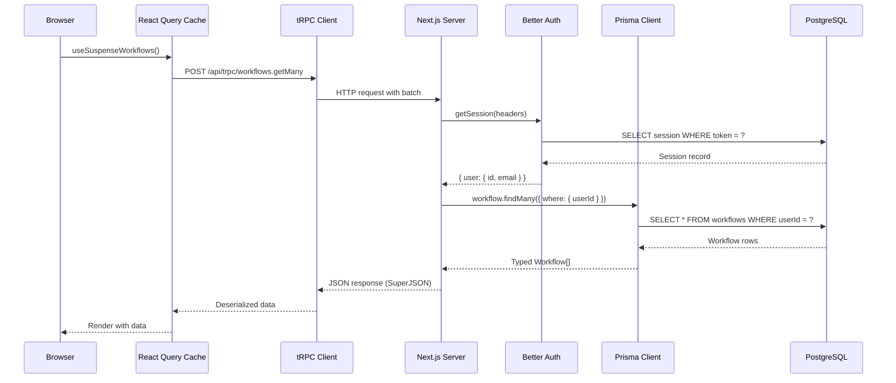
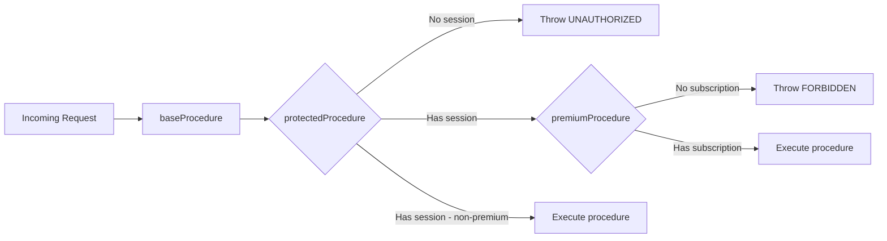
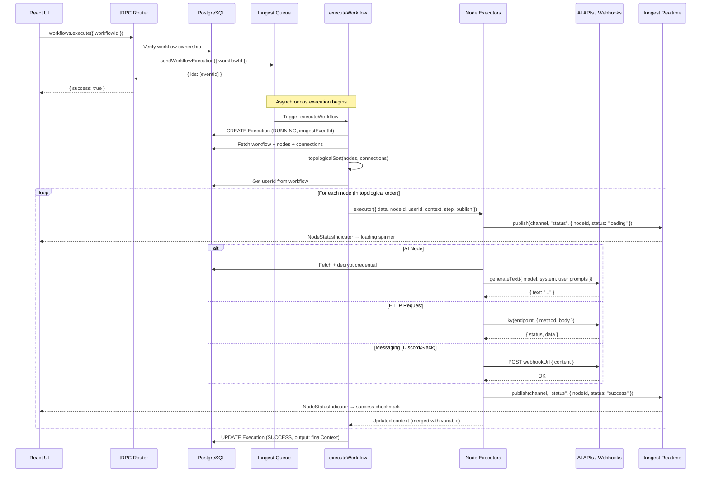
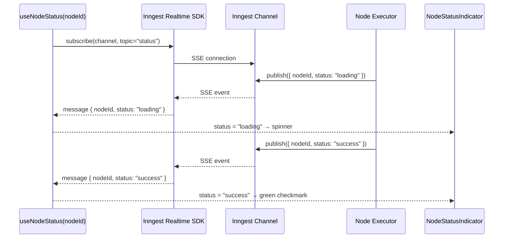
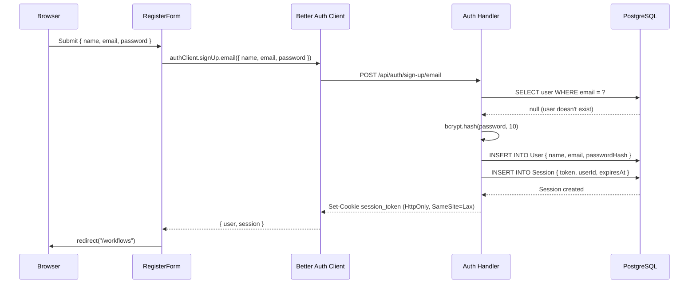
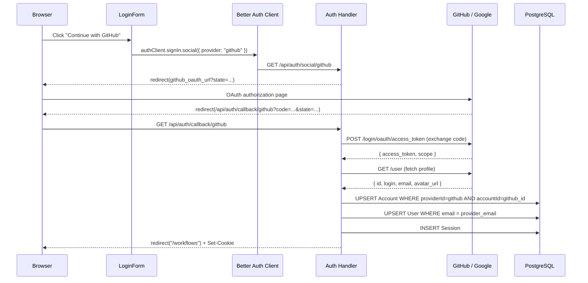

# System Architecture

NodeBase is a monolithic full-stack Next.js application with a serverless background job layer. This document describes every architectural layer, component boundary, and data flow in the system.

---

## Table of Contents

1. [System Context](#1-system-context)
2. [Container Architecture](#2-container-architecture)
3. [Component Map](#3-component-map)
4. [Request Lifecycle](#4-request-lifecycle)
5. [Workflow Execution Flow](#5-workflow-execution-flow)
6. [Real-time Status Flow](#6-real-time-status-flow)
7. [Authentication Flow](#7-authentication-flow)
8. [Technology Rationale](#8-technology-rationale)
9. [Scalability Notes](#9-scalability-notes)

---

## 1. System Context

The diagram below shows NodeBase in relation to every external actor and system.



---

## 2. Container Architecture

NodeBase runs as a single Next.js deployment but logically separates concerns into distinct containers:



---

## 3. Component Map

### Frontend Layer (`src/app/`, `src/features/`, `src/components/`)

```
Browser
├── (auth) routes
│   ├── /login          → LoginForm (Better Auth email/social)
│   └── /sign-up        → RegisterForm
│
└── (dashboard) routes
    ├── /workflows       → WorkflowList (tRPC: workflows.getMany)
    │   └── /workflows/[id]/editor
    │       └── EditorCanvas (React Flow)
    │           ├── NodeSelector (add node popup)
    │           ├── WorkflowNode (per node: config dialog + status)
    │           ├── EditorHeader (name, save button)
    │           └── ExecuteButton (manual trigger only)
    │
    ├── /credentials     → CredentialList (tRPC: credentials.getMany)
    │
    └── /executions      → ExecutionList (tRPC: executions.getMany)
        └── /executions/[id]
            └── ExecutionDetail (status, output, nodes)
```

### Backend Layer (`src/trpc/`, `src/inngest/`, `src/lib/`)

```
API Layer
├── /api/trpc/[trpc]        → tRPC fetch adapter
│   └── AppRouter
│       ├── workflows.*     → WorkflowRouter (6 procedures)
│       ├── credentials.*   → CredentialRouter (6 procedures)
│       └── executions.*    → ExecutionRouter (2 procedures)
│
├── /api/auth/[...all]      → Better Auth handler (all auth routes)
│
├── /api/inngest            → Inngest SDK handler
│   └── executeWorkflow     → Orchestrates workflow execution
│
├── /api/webhooks/stripe    → Stripe event receiver
└── /api/webhooks/google-form → Google Form submission receiver
```

---

## 4. Request Lifecycle

### Standard tRPC Request (e.g., `workflows.getMany`)



### Protected vs Premium Procedures



---

## 5. Workflow Execution Flow

This is the core data flow — from the user clicking "Execute" to seeing results.



### Context Propagation

Each node executor receives the accumulated `context` object and returns an updated copy:

```
Initial context: {}
  → after MANUAL_TRIGGER: {}
  → after HTTP_REQUEST (variableName="api"):
      { api: { httpResponse: { status: 200, data: {...} } } }
  → after GEMINI (variableName="summary"):
      { api: { ... }, summary: { text: "Summary of data..." } }
  → after SLACK:
      { api: { ... }, summary: { ... }, notification: { messageContent: "..." } }
```

Handlebars templates in node config can reference prior results:
```
"Summarize this: {{api.httpResponse.data.content}}"
```

---

## 6. Real-time Status Flow



Each node type has its own named Inngest channel (e.g., `openai-execution`, `anthropic-execution`). The `useNodeStatus` hook filters messages by `nodeId` to display per-node status.

---

## 7. Authentication Flow

### Email/Password Registration



### OAuth Flow (GitHub / Google)



---

## 8. Technology Rationale

| Decision | Choice | Alternative Considered | Reason |
|----------|--------|----------------------|--------|
| Framework | Next.js 15 App Router | Express + React | RSC + colocation of server/client code, Vercel deployment |
| API layer | tRPC | REST / GraphQL | End-to-end TypeScript types without code generation |
| ORM | Prisma 7 | Drizzle | Mature ecosystem, Prisma Studio, strong typing |
| Database | Neon (PostgreSQL) | PlanetScale / Supabase | Serverless scaling, standard Postgres compatibility |
| Job queue | Inngest | BullMQ / SQS | Serverless (no Redis), built-in Realtime, dev server |
| Auth | Better Auth | NextAuth / Clerk | Plugin architecture, Polar integration, full control |
| Payments | Polar.sh | Stripe Billing | Better auth plugin, simpler OSS billing model |
| State (client) | Jotai | Zustand / Redux | Atomic model, minimal boilerplate, React 19 compatible |
| State (URL) | Nuqs | Manual URLSearchParams | Type-safe, server/client compatible |
| Encryption | Cryptr | node:crypto (manual) | Simple AES wrapper, no IV management overhead |
| Linting | Biome | ESLint + Prettier | Single tool, faster, zero config |
| Versioning | Semantic Release | Manual | Automated changelog and version bumps |

---

## 9. Scalability Notes

### Current Architecture

- **Single deployment** — Next.js app handles both UI and API in one process
- **Stateless** — Session state stored in DB; any instance handles any request
- **Serverless job execution** — Inngest scales independently; no persistent workers needed
- **Connection pooling** — Neon's built-in pooler handles connection limits

### Scaling Bottlenecks

| Bottleneck | Current Mitigation | Future Solution |
|-----------|-------------------|-----------------|
| DB connection limits | Neon pooler | PgBouncer / read replicas |
| AI API rate limits | Per-user credentials | Retry logic, queue throttling |
| Inngest function timeout | Retries = 0 (dev mode) | Enable retries, set timeouts |
| Realtime connections | Inngest Realtime SSE | Same — Inngest handles scaling |
| Credential decryption | In-memory per request | Edge caching (careful with security) |

### Horizontal Scaling

Because the application is stateless and sessions are DB-backed, it can scale horizontally without coordination:

```
                    ┌─────────────────┐
                    │   Load Balancer │
                    └────────┬────────┘
               ┌─────────────┼─────────────┐
         ┌─────▼────┐  ┌─────▼────┐  ┌─────▼────┐
         │ Next.js  │  │ Next.js  │  │ Next.js  │
         │ Instance │  │ Instance │  │ Instance │
         └─────┬────┘  └─────┬────┘  └─────┬────┘
               └─────────────┼─────────────┘
                    ┌─────────▼────────┐
                    │  Neon PostgreSQL │
                    └──────────────────┘
```

All instances share the same Neon database and Inngest account, so any instance can serve any request.
