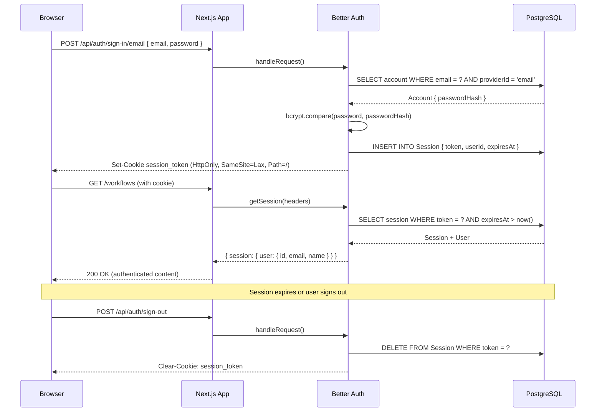
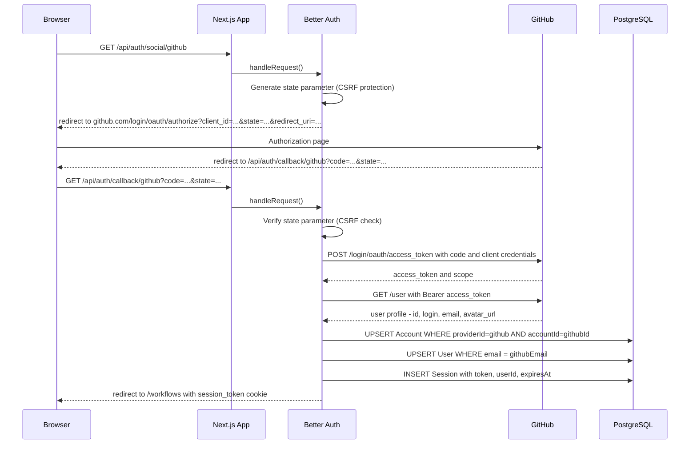
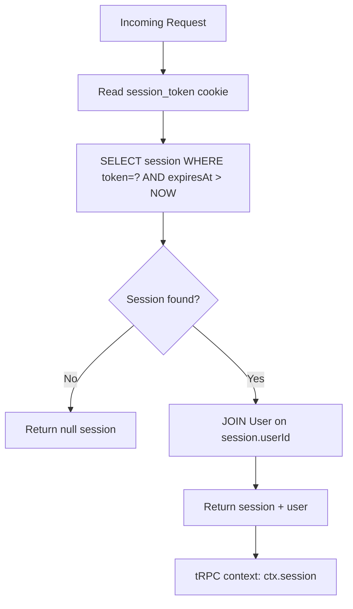

# Authentication

NodeBase uses [Better Auth](https://www.better-auth.com/) for all authentication. Better Auth is a TypeScript-first auth library that provides email/password authentication, social OAuth providers, session management, and a plugin system.

**Auth config:** `src/lib/auth.ts`  
**Auth client:** `src/lib/auth-client.ts`  
**Auth utilities:** `src/lib/auth-utils.ts`  
**Auth API:** `/api/auth/[...all]` → `src/app/api/auth/[...all]/route.ts`

---

## Table of Contents

1. [Supported Methods](#1-supported-methods)
2. [Configuration](#2-configuration)
3. [Session Lifecycle](#3-session-lifecycle)
4. [OAuth Flow](#4-oauth-flow)
5. [Server-side Auth Helpers](#5-server-side-auth-helpers)
6. [tRPC Auth Middleware](#6-trpc-auth-middleware)
7. [Client-side Auth Hooks](#7-client-side-auth-hooks)
8. [Subscription Integration](#8-subscription-integration)
9. [Auth Database Tables](#9-auth-database-tables)

---

## 1. Supported Methods

| Method | Status | Details |
|--------|--------|---------|
| Email + Password | Enabled | Auto sign-in on registration |
| GitHub OAuth | Enabled | Requires `GITHUB_CLIENT_ID` + `GITHUB_CLIENT_SECRET` |
| Google OAuth | Enabled | Requires `GOOGLE_CLIENT_ID` + `GOOGLE_CLIENT_SECRET` |
| Magic Link | Not implemented | — |
| Two-Factor Auth | Not implemented | — |

---

## 2. Configuration

```typescript
// src/lib/auth.ts
export const auth = betterAuth({
  database: prismaAdapter(db, { provider: "postgresql" }),

  emailAndPassword: {
    enabled: true,
    autoSignIn: true,  // Automatically sign in after registration
  },

  socialProviders: {
    github: {
      clientId: process.env.GITHUB_CLIENT_ID!,
      clientSecret: process.env.GITHUB_CLIENT_SECRET!,
    },
    google: {
      clientId: process.env.GOOGLE_CLIENT_ID!,
      clientSecret: process.env.GOOGLE_CLIENT_SECRET!,
    },
  },

  trustedOrigins: [
    `https://${process.env.NGROK_URL}`,  // Ngrok tunnel (development)
  ],

  plugins: [
    polar({ ... }),       // Polar.sh subscription plugin
    polarCheckout({ ... }), // Checkout flow plugin
    polarPortal(),        // Customer portal plugin
    polarUsage(),         // Usage tracking plugin
  ],
});
```

### Polar.sh Plugin

The Polar plugin extends Better Auth to manage subscription state. It:
- Adds `/api/auth/polar/*` routes for checkout and portal
- Stores customer ID with each user
- Provides `getCustomerState()` for checking subscription status

**Checkout product ID:** Configured in `auth.ts` as the Polar product ID for the "Pro" plan.

---

## 3. Session Lifecycle



**Session properties:**
- Token: cryptographically random string
- Storage: `HttpOnly` cookie (not accessible to JavaScript)
- Expiry: Set by Better Auth (default: 30 days)
- Rotation: Better Auth can rotate tokens on each request (configurable)

---

## 4. OAuth Flow

### GitHub OAuth



### Trusted Origins

Because OAuth callbacks must come from the application domain, Better Auth validates origins. For local development with Ngrok:

```typescript
trustedOrigins: [`https://${process.env.NGROK_URL}`]
```

Without this, OAuth callbacks through Ngrok would be rejected.

---

## 5. Server-side Auth Helpers

### `requireAuth()`

**File:** `src/lib/auth-utils.ts`

Use in Server Components and Server Actions that require authentication. Redirects to `/login` if no session.

```typescript
import { requireAuth } from "@/lib/auth-utils";

export default async function ProtectedPage() {
  const session = await requireAuth();
  // session.user.id, session.user.email, etc.
  return <div>Hello {session.user.name}</div>;
}
```

**Implementation:**
```typescript
export async function requireAuth() {
  const session = await auth.api.getSession({
    headers: await headers(),
  });

  if (!session) {
    redirect("/login");
  }

  return session;
}
```

### `requireUnauth()`

Use on auth pages (login, sign-up) to redirect already-authenticated users away.

```typescript
import { requireUnauth } from "@/lib/auth-utils";

export default async function LoginPage() {
  await requireUnauth();  // Redirects to "/" if already logged in
  return <LoginForm />;
}
```

### Direct Session Access

```typescript
import { auth } from "@/lib/auth";
import { headers } from "next/headers";

const session = await auth.api.getSession({ headers: await headers() });
if (session) {
  const userId = session.user.id;
}
```

---

## 6. tRPC Auth Middleware

**File:** `src/trpc/init.ts`

tRPC procedures are classified into three levels:

### `baseProcedure`

No authentication required. The context does not contain user information.

```typescript
export const baseProcedure = t.procedure;
```

### `protectedProcedure`

Requires a valid session. Throws `UNAUTHORIZED` if no session exists.

```typescript
export const protectedProcedure = t.procedure.use(async ({ ctx, next }) => {
  const session = await auth.api.getSession({ headers: await headers() });

  if (!session) {
    throw new TRPCError({ code: "UNAUTHORIZED" });
  }

  return next({ ctx: { ...ctx, session } });
});
```

**Available in context after middleware:**
```typescript
ctx.session.user.id     // User ID
ctx.session.user.email  // User email
ctx.session.user.name   // Display name
```

### `premiumProcedure`

Requires an active Polar.sh subscription. Throws `FORBIDDEN` for users without a subscription.

```typescript
export const premiumProcedure = protectedProcedure.use(async ({ ctx, next }) => {
  const customer = await polar.customers.getByExternalId({ externalId: ctx.session.user.id });
  const hasSubscription = customer.subscriptions?.some(
    sub => sub.status === "active"
  );

  if (!hasSubscription) {
    throw new TRPCError({ code: "FORBIDDEN" });
  }

  return next({ ctx });
});
```

**Used for:** `workflows.create`, `credentials.create`

---

## 7. Client-side Auth Hooks

**File:** `src/lib/auth-client.ts`

```typescript
import { createAuthClient } from "better-auth/react";

export const authClient = createAuthClient({
  baseURL: process.env.NEXT_PUBLIC_APP_URL,
  plugins: [polarClient()],
});
```

### Available hooks

```typescript
// Get current session (reactive)
const { data: session, isPending } = authClient.useSession();

// Sign up with email
await authClient.signUp.email({ name, email, password });

// Sign in with email
await authClient.signIn.email({ email, password });

// Sign in with OAuth
await authClient.signIn.social({ provider: "github" }); // or "google"

// Sign out
await authClient.signOut();
```

### Usage in login form

```typescript
// src/features/auth/components/login-form/index.tsx

const handleSubmit = async (values: FormValues) => {
  const { error } = await authClient.signIn.email({
    email: values.email,
    password: values.password,
  });

  if (error) {
    toast.error(error.message);
    return;
  }

  router.push("/");
};

const handleGitHubLogin = async () => {
  await authClient.signIn.social({ provider: "github" });
};
```

---

## 8. Subscription Integration

The auth client includes the Polar plugin:

```typescript
export const authClient = createAuthClient({
  plugins: [polarClient()],
});
```

This adds auth client methods for:

```typescript
// Get current customer state (subscription status)
const { data: customer } = authClient.useSession();

// Initiate checkout
await authClient.checkout({
  products: ["product_id"],
  successUrl: process.env.NEXT_PUBLIC_APP_URL,
});

// Open customer portal
await authClient.portal();
```

See [docs/SUBSCRIPTIONS.md](./SUBSCRIPTIONS.md) for full subscription documentation.

---

## 9. Auth Database Tables

Better Auth manages these tables automatically:

### `Session` table

| Column | Description |
|--------|-------------|
| `id` | Primary key |
| `token` | Session token (sent as cookie) |
| `userId` | FK → User |
| `expiresAt` | Expiration timestamp |
| `ipAddress` | Client IP (audit) |
| `userAgent` | Browser user agent (audit) |

### `Account` table

| Column | Description |
|--------|-------------|
| `id` | Primary key |
| `accountId` | Provider-assigned user ID (e.g., GitHub user ID) |
| `providerId` | e.g., "github", "google", "email" |
| `userId` | FK → User |
| `accessToken` | OAuth access token (nullable) |
| `password` | Hashed password (email provider only) |

### `Verification` table

| Column | Description |
|--------|-------------|
| `identifier` | Email address being verified |
| `value` | Verification token |
| `expiresAt` | Token expiry |

### Auth Middleware Chain


