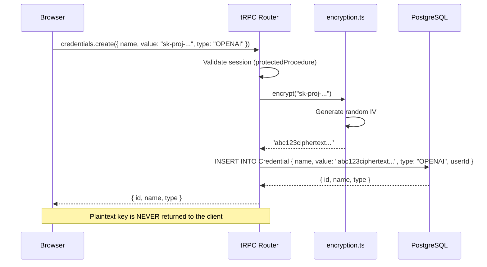
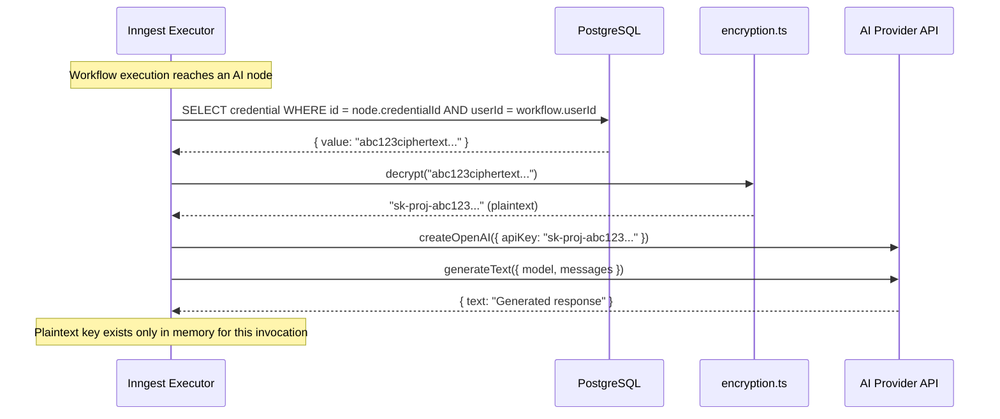

# Credential Management

NodeBase allows users to store API keys for AI providers (OpenAI, Anthropic, Google Gemini) securely. All credentials are AES-encrypted before storage and decrypted only at workflow execution time — plaintext keys never leave the server.

**Encryption module:** `src/lib/encryption.ts`  
**Credential router:** `src/features/credentials/server/routers.ts`  
**Executor usage:** `src/features/executions/components/{openai,anthropic,gemini}/executor/index.ts`

---

## Table of Contents

1. [Credential Types](#1-credential-types)
2. [Encryption Design](#2-encryption-design)
3. [Storage Flow](#3-storage-flow)
4. [Runtime Decryption Flow](#4-runtime-decryption-flow)
5. [Credential CRUD](#5-credential-crud)
6. [Using Credentials in Nodes](#6-using-credentials-in-nodes)
7. [Security Considerations](#7-security-considerations)

---

## 1. Credential Types

| Type | Used By | Provider |
|------|---------|---------|
| `OPENAI` | OPENAI nodes | OpenAI API (GPT-4) |
| `ANTHROPIC` | ANTHROPIC nodes | Anthropic API (Claude Sonnet) |
| `GEMINI` | GEMINI nodes | Google AI Studio (Gemini Flash) |

Users can create multiple credentials of each type (e.g., multiple OpenAI keys for different projects) and reference them by name from node configurations.

---

## 2. Encryption Design

NodeBase uses [Cryptr](https://www.npmjs.com/package/cryptr) — a minimal AES-256-GCM wrapper around Node.js `crypto`.

**File:** `src/lib/encryption.ts`

```typescript
import Cryptr from "cryptr";

const cryptr = new Cryptr(process.env.ENCRYPTION_KEY!);

export function encrypt(text: string): string {
  return cryptr.encrypt(text);
}

export function decrypt(text: string): string {
  return cryptr.decrypt(text);
}
```

**Algorithm:** AES-256-GCM (Authenticated Encryption with Associated Data)  
**Key:** `ENCRYPTION_KEY` env var — 256-bit hex string (64 chars)  
**IV:** Randomly generated by Cryptr for each encryption call  
**Authentication tag:** Included in the ciphertext (prevents tampering)

```mermaid
flowchart LR
    A[Plaintext API Key<br/>"sk-proj-abc123..."] --> B[Cryptr.encrypt]
    B --> C{AES-256-GCM}
    C --> D[Random IV<br/>12 bytes]
    C --> E[ENCRYPTION_KEY<br/>32 bytes]
    C --> F[Ciphertext + Auth Tag]
    F --> G[Base64 string<br/>stored in DB]
```

**Ciphertext format** (Cryptr internals):
```
[IV_hex (24 chars)][AUTH_TAG_hex (32 chars)][ENCRYPTED_hex]
```

All three components are concatenated into a single base64 string that is stored in the `value` column of the `Credential` table.

---

## 3. Storage Flow



**Key points:**
- The plaintext API key is encrypted immediately upon receipt in the router
- The encrypted value is stored in the DB
- The plaintext key is never logged, never stored, never returned to the client
- Even the tRPC response after creation does not include the plaintext

---

## 4. Runtime Decryption Flow

Credentials are decrypted only inside the Inngest executor function, never in client-facing code.



**Security properties:**
- Decryption happens inside the Inngest serverless function (server-only)
- Plaintext key exists in memory only during the execution step
- Key is never written to logs, disk, or database after decryption
- User ID is verified before fetching the credential (ownership check)

---

## 5. Credential CRUD

### Create

```
POST /api/trpc/credentials.create
Auth: Premium required

Input:
  name: string       "My OpenAI Key"
  value: string      "sk-proj-..."  ← plaintext
  type: CredentialType

Server side:
  1. Validate session (premiumProcedure)
  2. encrypt(value)
  3. db.credential.create({ ...encrypted... })

Response:
  { id, name, type, userId }  ← no value returned
```

### Update

```
POST /api/trpc/credentials.update
Auth: Protected required

Input:
  credentialId: string
  name?: string
  value?: string    ← plaintext (re-encrypted on server)

Server side:
  1. Validate session + ownership
  2. If value provided: encrypt(value)
  3. db.credential.update({ ...data... })

Response: updated credential object
```

### Delete

```
POST /api/trpc/credentials.remove
Auth: Protected required

Input:
  credentialId: string

Side effect: Nodes referencing this credential have credentialId set to null
```

### List

```
GET /api/trpc/credentials.getMany
Auth: Protected

Returns: Paginated list with encrypted values
Note: The encrypted value is returned but should never be displayed to users
```

---

## 6. Using Credentials in Nodes

When configuring an AI node (OPENAI, ANTHROPIC, or GEMINI), users select a credential from a dropdown populated by `credentials.getByType`.

**Node data structure (stored in DB):**
```json
{
  "credentialId": "cm_abc123",
  "variableName": "aiOutput",
  "systemPrompt": "You are helpful.",
  "userPrompt": "Summarize: {{prevNode.text}}"
}
```

The `credentialId` is the database ID of the credential. The actual API key is never stored in node data.

**Executor pattern (all AI nodes):**

```typescript
// src/features/executions/components/openai/executor/index.ts

export const openAiExecutor: NodeExecutor = async ({ data, userId, context, step, nodeId, publish }) => {
  await publish(openaiChannel, statusTopic, { nodeId, status: "loading" });

  const result = await step.run("openai-node", async () => {
    // 1. Fetch encrypted credential (with ownership check)
    const credential = await db.credential.findFirst({
      where: { id: data.credentialId, userId },
    });

    if (!credential) throw new Error("Credential not found");

    // 2. Decrypt at runtime
    const apiKey = decrypt(credential.value);

    // 3. Create AI provider client
    const openai = createOpenAI({ apiKey });

    // 4. Render Handlebars templates
    const userPrompt = Handlebars.compile(data.userPrompt)(context);
    const systemPrompt = data.systemPrompt
      ? Handlebars.compile(data.systemPrompt)(context)
      : undefined;

    // 5. Generate text
    const { text } = await generateText({
      model: openai("gpt-4"),
      system: systemPrompt,
      prompt: userPrompt,
      experimental_telemetry: { isEnabled: true, recordInputs: true, recordOutputs: true },
    });

    return { text };
  });

  await publish(openaiChannel, statusTopic, { nodeId, status: "success" });

  return { ...context, [data.variableName]: result };
};
```

---

## 7. Security Considerations

### What's protected

- Credentials are encrypted at rest with AES-256-GCM
- Authentication tags prevent ciphertext tampering
- Each credential's owner is verified before decryption (`userId` check)
- Plaintext keys are never returned to API clients
- Plaintext keys are never logged
- Plaintext keys exist in server memory only during execution

### What's not protected

- If the `ENCRYPTION_KEY` environment variable is compromised, all credentials can be decrypted
- If the database is compromised without the key, data is unreadable
- Keys are decrypted inside Inngest cloud execution — trust Inngest's infrastructure security

### Recommendations

1. **Rotate ENCRYPTION_KEY carefully** — Rotating requires re-encrypting all credential values. Build a migration script before rotating.

2. **Use separate credentials per user** — Each user manages their own keys. Avoid sharing a single global API key for all users.

3. **Scope API keys narrowly** — Create OpenAI/Anthropic keys with minimal required permissions.

4. **Monitor usage** — Enable usage tracking on your AI provider dashboards to detect unauthorized access.

5. **Principle of least privilege** — The Inngest executor only fetches the specific credential for the current node, not all credentials.

### Threat Model

| Threat | Mitigation |
|--------|-----------|
| Database dump | AES-256-GCM encryption; useless without ENCRYPTION_KEY |
| ENCRYPTION_KEY leak | Keys stored as env var (Vercel), not in code |
| Man-in-the-middle | HTTPS for all DB connections (Neon TLS) |
| Unauthorized access | userId ownership check before fetching credential |
| Logging exposure | Plaintext key never passed to logger |
| Client-side exposure | Decryption only in server-side Inngest function |
