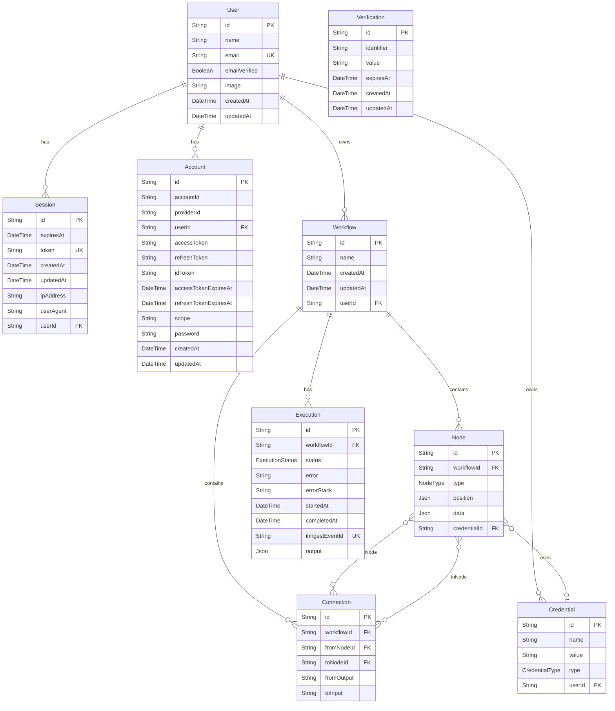

# Database

NodeBase uses PostgreSQL (Neon) accessed through Prisma ORM v7. This document covers the complete schema, entity relationships, migration history, and indexing strategy.

**Schema file:** [`prisma/schema.prisma`](../prisma/schema.prisma)  
**Generated client:** `src/generated/prisma/`  
**Adapter:** `@prisma/adapter-pg` (PrismaPg) for Neon serverless compatibility

---

## Table of Contents

1. [Entity Relationship Diagram](#1-entity-relationship-diagram)
2. [Model Reference](#2-model-reference)
   - [User](#user)
   - [Session](#session)
   - [Account](#account)
   - [Verification](#verification)
   - [Workflow](#workflow)
   - [Node](#node)
   - [Connection](#connection)
   - [Credential](#credential)
   - [Execution](#execution)
3. [Enums](#3-enums)
4. [Indexes and Constraints](#4-indexes-and-constraints)
5. [Migration History](#5-migration-history)
6. [Data Retention](#6-data-retention)
7. [Prisma Client Usage](#7-prisma-client-usage)

---

## 1. Entity Relationship Diagram



---

## 2. Model Reference

### User

Core user identity. Created on registration (email/password or OAuth).

| Field | Type | Nullable | Default | Notes |
|-------|------|----------|---------|-------|
| `id` | String | No | cuid() | Primary key |
| `name` | String | No | — | Display name |
| `email` | String | No | — | Unique; login identifier |
| `emailVerified` | Boolean | No | false | Set true after email verification |
| `image` | String | Yes | — | Avatar URL from OAuth provider |
| `createdAt` | DateTime | No | now() | |
| `updatedAt` | DateTime | No | auto | Auto-updated |

**Relations:** `sessions[]`, `accounts[]`, `workflows[]`, `credentials[]`

---

### Session

Active authentication sessions managed by Better Auth. One user can have multiple sessions (multiple devices).

| Field | Type | Nullable | Default | Notes |
|-------|------|----------|---------|-------|
| `id` | String | No | cuid() | Primary key |
| `expiresAt` | DateTime | No | — | Better Auth sets expiration |
| `token` | String | No | — | Unique session token (sent as cookie) |
| `createdAt` | DateTime | No | now() | |
| `updatedAt` | DateTime | No | auto | |
| `ipAddress` | String | Yes | — | Client IP for audit |
| `userAgent` | String | Yes | — | Browser/client for audit |
| `userId` | String | No | — | FK → User.id |

**Cascade:** Session deleted when user is deleted.

---

### Account

OAuth provider accounts linked to a user. A single user can have multiple provider accounts (e.g., GitHub + Google).

| Field | Type | Nullable | Default | Notes |
|-------|------|----------|---------|-------|
| `id` | String | No | cuid() | Primary key |
| `accountId` | String | No | — | Provider-assigned user ID |
| `providerId` | String | No | — | e.g., "github", "google" |
| `userId` | String | No | — | FK → User.id |
| `accessToken` | String | Yes | — | OAuth access token |
| `refreshToken` | String | Yes | — | OAuth refresh token |
| `idToken` | String | Yes | — | OIDC ID token |
| `accessTokenExpiresAt` | DateTime | Yes | — | |
| `refreshTokenExpiresAt` | DateTime | Yes | — | |
| `scope` | String | Yes | — | Granted OAuth scopes |
| `password` | String | Yes | — | Hashed password (email provider) |
| `createdAt` | DateTime | No | now() | |
| `updatedAt` | DateTime | No | auto | |

---

### Verification

Temporary verification tokens for email confirmation flows.

| Field | Type | Nullable | Default | Notes |
|-------|------|----------|---------|-------|
| `id` | String | No | cuid() | Primary key |
| `identifier` | String | No | — | e.g., email address |
| `value` | String | No | — | Verification code/token |
| `expiresAt` | DateTime | No | — | Token expiration |
| `createdAt` | DateTime | Yes | now() | |
| `updatedAt` | DateTime | Yes | auto | |

---

### Workflow

Top-level automation workflow owned by a user. Contains nodes and connections forming a directed acyclic graph (DAG).

| Field | Type | Nullable | Default | Notes |
|-------|------|----------|---------|-------|
| `id` | String | No | cuid() | Primary key |
| `name` | String | No | — | User-provided display name |
| `createdAt` | DateTime | No | now() | |
| `updatedAt` | DateTime | No | auto | |
| `userId` | String | No | — | FK → User.id |

**Relations:** `nodes[]`, `connections[]`, `executions[]`

---

### Node

A single node in the workflow graph. Stores its visual position and configuration data as JSON.

| Field | Type | Nullable | Default | Notes |
|-------|------|----------|---------|-------|
| `id` | String | No | cuid() | Primary key; used as React Flow node ID |
| `workflowId` | String | No | — | FK → Workflow.id |
| `type` | NodeType | No | — | Enum value (10 types) |
| `position` | Json | No | — | `{ x: number, y: number }` for canvas position |
| `data` | Json | No | — | Node-specific config (prompts, URLs, etc.) |
| `credentialId` | String | Yes | — | FK → Credential.id (AI nodes only) |

**Relations:**
- `outputConnections[]` — Connections where this node is the source
- `inputConnections[]` — Connections where this node is the target
- `credential` — Optional linked API credential

---

### Connection

A directed edge between two nodes. Enforces DAG structure with a unique constraint.

| Field | Type | Nullable | Default | Notes |
|-------|------|----------|---------|-------|
| `id` | String | No | cuid() | Primary key |
| `workflowId` | String | No | — | FK → Workflow.id |
| `fromNodeId` | String | No | — | FK → Node.id (source) |
| `toNodeId` | String | No | — | FK → Node.id (target) |
| `fromOutput` | String | No | "main" | Output handle name |
| `toInput` | String | No | "main" | Input handle name |

**Unique constraint:** `(fromNodeId, toNodeId, fromOutput, toInput)` — prevents duplicate edges between the same handles.

---

### Credential

Encrypted API keys and tokens that node executors use at runtime.

| Field | Type | Nullable | Default | Notes |
|-------|------|----------|---------|-------|
| `id` | String | No | cuid() | Primary key |
| `name` | String | No | — | User-provided label |
| `value` | String | No | — | AES-encrypted credential value |
| `type` | CredentialType | No | — | Enum: OPENAI, ANTHROPIC, GEMINI |
| `userId` | String | No | — | FK → User.id |

**Security:** The `value` field is always stored encrypted via `src/lib/encryption.ts`. Plaintext is never persisted.

**Relations:** `Node[]` — nodes referencing this credential

---

### Execution

A single workflow execution run. Created when a workflow starts and updated on completion or failure.

| Field | Type | Nullable | Default | Notes |
|-------|------|----------|---------|-------|
| `id` | String | No | cuid() | Primary key |
| `workflowId` | String | No | — | FK → Workflow.id |
| `status` | ExecutionStatus | No | RUNNING | RUNNING → SUCCESS or FAILED |
| `error` | String | Yes | — | Error message on failure |
| `errorStack` | String | Yes | — | Full stack trace on failure |
| `startedAt` | DateTime | No | now() | Created at execution start |
| `completedAt` | DateTime | Yes | — | Set on SUCCESS or FAILED |
| `inngestEventId` | String | No | — | Unique; links to Inngest event ID |
| `output` | Json | Yes | — | Final workflow context (all node outputs) |

**Cascade:** Executions deleted when workflow is deleted.

---

## 3. Enums

### NodeType

Defines all available node types in the workflow editor.

| Value | Category | Description |
|-------|----------|-------------|
| `INITIAL` | Trigger | Placeholder node (auto-created on workflow creation) |
| `MANUAL_TRIGGER` | Trigger | User-initiated execution from the editor |
| `HTTP_REQUEST` | Action | HTTP call to any external API |
| `GOOGLE_FORM_TRIGGER` | Trigger | Google Form submission webhook |
| `STRIPE_TRIGGER` | Trigger | Stripe event webhook |
| `GEMINI` | AI | Google Gemini Flash text generation |
| `OPENAI` | AI | OpenAI GPT-4 text generation |
| `ANTHROPIC` | AI | Anthropic Claude Sonnet text generation |
| `DISCORD` | Output | Discord webhook message |
| `SLACK` | Output | Slack webhook message |

### CredentialType

| Value | Associated Node | Provider |
|-------|----------------|---------|
| `OPENAI` | OPENAI | OpenAI API |
| `ANTHROPIC` | ANTHROPIC | Anthropic API |
| `GEMINI` | GEMINI | Google AI Studio |

### ExecutionStatus

| Value | Meaning |
|-------|---------|
| `RUNNING` | Execution in progress |
| `SUCCESS` | All nodes completed successfully |
| `FAILED` | One or more nodes threw an error |

---

## 4. Indexes and Constraints

| Table | Index / Constraint | Columns | Type |
|-------|-------------------|---------|------|
| `User` | PRIMARY | `id` | PK |
| `User` | UNIQUE | `email` | UK |
| `Session` | PRIMARY | `id` | PK |
| `Session` | UNIQUE | `token` | UK |
| `Account` | PRIMARY | `id` | PK |
| `Verification` | PRIMARY | `id` | PK |
| `Workflow` | PRIMARY | `id` | PK |
| `Workflow` | INDEX | `userId` | FK index |
| `Node` | PRIMARY | `id` | PK |
| `Node` | INDEX | `workflowId` | FK index |
| `Node` | INDEX | `credentialId` | FK index |
| `Connection` | PRIMARY | `id` | PK |
| `Connection` | UNIQUE | `(fromNodeId, toNodeId, fromOutput, toInput)` | UK |
| `Connection` | INDEX | `workflowId` | FK index |
| `Credential` | PRIMARY | `id` | PK |
| `Credential` | INDEX | `userId` | FK index |
| `Execution` | PRIMARY | `id` | PK |
| `Execution` | UNIQUE | `inngestEventId` | UK |
| `Execution` | INDEX | `workflowId` | FK index |

---

## 5. Migration History

All migrations live in `prisma/migrations/`. Each directory name encodes the timestamp and a description.

| # | Timestamp | Name | Changes |
|---|-----------|------|---------|
| 1 | 2025-10-19 10:15 | `init` | Initial `User` and `Post` models |
| 2 | 2025-10-19 13:40 | `better_auth_fields` | Added `Session`, `Account`, `Verification` for Better Auth |
| 3 | 2025-10-20 08:37 | `workflows_table` | Added `Workflow` and `Credential` models |
| 4 | 2025-10-20 19:30 | `workflows_update` | Schema refinements to Workflow fields |
| 5 | 2026-01-10 13:25 | `react_flow_tables` | Added `Node` and `Connection` models |
| 6 | 2026-02-14 13:32 | `stripe_trigger_node` | Added `STRIPE_TRIGGER` to `NodeType` enum |
| 7 | 2026-02-18 09:34 | `ai_nodes_types` | Added `GEMINI`, `OPENAI` to `NodeType` enum |
| 8 | 2026-02-18 12:11 | `anthropic_nodes_types` | Added `ANTHROPIC` to `NodeType` enum |
| 9 | 2026-06-27 08:48 | `credential_schema` | Added `CredentialType` enum and Credential model |
| 10 | 2026-06-27 12:16 | `slack_nodes` | Added `SLACK` to `NodeType` enum |
| 11 | 2026-06-27 14:28 | `execution_schema` | Added `Execution` model and `ExecutionStatus` enum |

### Running Migrations

```bash
# Apply all pending migrations (development)
npx prisma migrate dev

# Apply migrations in production (CI/CD)
npx prisma migrate deploy

# Reset database (destroys all data)
npx prisma migrate reset

# Check migration status
npx prisma migrate status
```

---

## 6. Data Retention

| Model | Deletion Behavior | Notes |
|-------|------------------|-------|
| `User` | Hard delete | Cascades to sessions, accounts, workflows, credentials |
| `Session` | Hard delete | Pruned by Better Auth on expiry |
| `Verification` | Hard delete | Pruned by Better Auth after use/expiry |
| `Workflow` | Hard delete | Cascades to nodes, connections, executions |
| `Node` | Hard delete | Cascades when workflow deleted |
| `Connection` | Hard delete | Cascades when workflow or node deleted |
| `Credential` | Hard delete | Node `credentialId` set to null (optional FK) |
| `Execution` | Hard delete | Cascades when workflow deleted |

No soft-delete or archival pattern is implemented currently. All deletes are permanent.

---

## 7. Prisma Client Usage

The Prisma client is a singleton initialized once per server process:

```typescript
// src/lib/db.ts
import { PrismaClient } from "@/generated/prisma";
import { PrismaPg } from "@prisma/adapter-pg";
import pg from "pg";

const pool = new pg.Pool({ connectionString: process.env.DATABASE_URL });
const adapter = new PrismaPg(pool);

const createPrismaClient = () => new PrismaClient({ adapter });

const globalForPrisma = globalThis as unknown as {
  prisma: ReturnType<typeof createPrismaClient> | undefined;
};

export const db =
  globalForPrisma.prisma ?? createPrismaClient();

if (process.env.NODE_ENV !== "production") globalForPrisma.prisma = db;
```

**Why singleton?** Next.js in development mode re-evaluates modules on hot reload. Without the global singleton, each reload creates a new Prisma client and exhausts the connection pool.

### Common Query Patterns

```typescript
// Fetch workflow with full graph
const workflow = await db.workflow.findUnique({
  where: { id, userId },
  include: {
    nodes: { include: { credential: true } },
    connections: true,
  },
});

// Paginated list with search
const workflows = await db.workflow.findMany({
  where: {
    userId,
    name: { contains: search, mode: "insensitive" },
  },
  orderBy: { createdAt: "desc" },
  skip: (page - 1) * pageSize,
  take: pageSize,
});

// Transaction: save full workflow graph
await db.$transaction([
  db.node.deleteMany({ where: { workflowId } }),
  db.connection.deleteMany({ where: { workflowId } }),
  db.node.createMany({ data: nodes }),
  db.connection.createMany({ data: connections }),
]);
```
