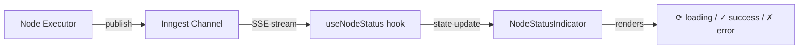

# Monitoring & Observability

NodeBase integrates Sentry for error tracking, Inngest's built-in dashboard for workflow monitoring, and tracks execution state in the database.

---

## Table of Contents

1. [Sentry Error Tracking](#1-sentry-error-tracking)
2. [Inngest Dashboard](#2-inngest-dashboard)
3. [Execution Tracking](#3-execution-tracking)
4. [Real-time Status Channels](#4-real-time-status-channels)
5. [Logging](#5-logging)
6. [Alerting Recommendations](#6-alerting-recommendations)

---

## 1. Sentry Error Tracking

NodeBase uses [@sentry/nextjs](https://docs.sentry.io/platforms/javascript/guides/nextjs/) for error monitoring in both server and edge runtimes.

### Configuration Files

| File | Purpose |
|------|---------|
| `sentry.server.config.ts` | Node.js runtime configuration |
| `sentry.edge.config.ts` | Edge runtime configuration |
| `src/instrumentation.ts` | Next.js instrumentation hook (loads Sentry) |
| `next.config.ts` | Sentry plugin (source maps, tunnel) |

### Server Configuration

```typescript
// sentry.server.config.ts
import * as Sentry from "@sentry/nextjs";

Sentry.init({
  dsn: "https://41a1662c...@o4510221854834688.ingest.us.sentry.io/4510221867483136",
  tracesSampleRate: 1.0,       // 100% of transactions sampled
  sendDefaultPii: true,        // Includes user info in events
  integrations: [
    Sentry.vercelAIIntegration(),    // Tracks AI SDK calls (inputs/outputs)
    Sentry.consoleIntegration({      // Captures console.log, console.warn, console.error
      levels: ["log", "warn", "error"],
    }),
  ],
});
```

### Source Maps

Source maps are automatically uploaded to Sentry during `next build`:

```typescript
// next.config.ts (via withSentryConfig)
{
  org: "na-sku",
  project: "nodebase",
  authToken: process.env.SENTRY_AUTH_TOKEN,
  widenClientFileUpload: true,    // Better stack traces
  silent: !process.env.CI,        // Quiet in local builds
  automaticVercelMonitors: true,  // Vercel Cron monitoring
}
```

The tunnel route at `/monitoring` routes Sentry events through your own domain (avoids ad blockers).

### Instrumentation Hook

Next.js calls `src/instrumentation.ts` on server startup:

```typescript
// src/instrumentation.ts
export async function register() {
  if (process.env.NEXT_RUNTIME === "nodejs") {
    await import("../sentry.server.config");
  } else if (process.env.NEXT_RUNTIME === "edge") {
    await import("../sentry.edge.config");
  }
}

export const onRequestError = Sentry.captureRequestError;
```

### What Gets Captured

| Category | Details |
|----------|---------|
| Unhandled exceptions | All server-side errors |
| tRPC errors | `INTERNAL_SERVER_ERROR` level errors |
| Request errors | Via `onRequestError` |
| AI SDK calls | Inputs/outputs (via vercelAI integration) |
| Console events | log, warn, error from server code |
| Transactions | Full request traces (100% sample rate) |

### Viewing Events

1. Go to [sentry.io](https://sentry.io) → your project (`nodebase`)
2. **Issues** — Grouped error events
3. **Performance** — Transaction traces
4. **Replays** — Session replays (if configured)

---

## 2. Inngest Dashboard

### Development Dashboard

When running `npm run dev:all`, the Inngest dev server is at:
```
http://localhost:8288
```

Features:
- View all events sent to the queue
- Inspect function run logs
- Replay failed events
- View function step-by-step execution

### Production Dashboard

At [app.inngest.com](https://app.inngest.com):

1. **Apps** — See registered functions and sync status
2. **Events** — Browse all events sent
3. **Runs** — View execution history with step logs
4. **Metrics** — Function success/failure rates

### Debugging Failed Executions

1. Go to Inngest dashboard → **Runs**
2. Filter by status: **Failed**
3. Click any run to see:
   - Which step failed
   - Error message and stack trace
   - Step inputs/outputs
   - Retries attempted

The Inngest `onFailure` handler also updates the `Execution` record in the database (see section 3).

---

## 3. Execution Tracking

Every workflow run is persisted in the `Execution` table:

```typescript
// Execution record lifecycle:
{
  status: "RUNNING",            // Created when Inngest event received
  inngestEventId: "01ABC...",   // Links to Inngest run
  startedAt: new Date(),
  completedAt: null,
  error: null,
  errorStack: null,
  output: null,
}

// On success:
{
  status: "SUCCESS",
  completedAt: new Date(),
  output: { /* final workflow context */ },
}

// On failure:
{
  status: "FAILED",
  completedAt: new Date(),
  error: "Credential not found",
  errorStack: "Error: Credential not found\n    at openAiExecutor...",
}
```

### Querying Executions

Via the Executions page in the UI (`/executions`) or directly via tRPC:

```typescript
// Get all executions for current user
const { data } = useQuery(
  trpc.executions.getMany.queryOptions({ page: 1, pageSize: 10 })
);

// Get a specific execution with full output
const execution = await caller.executions.getOne({ executionId });
console.log(execution.output);      // Full workflow context
console.log(execution.error);       // Error message if failed
console.log(execution.errorStack);  // Stack trace if failed
```

### Execution Metrics

Query execution statistics directly from the database:

```sql
-- Success rate by workflow
SELECT
  w.name,
  COUNT(*) as total,
  SUM(CASE WHEN e.status = 'SUCCESS' THEN 1 ELSE 0 END) as successes,
  SUM(CASE WHEN e.status = 'FAILED' THEN 1 ELSE 0 END) as failures,
  ROUND(
    100.0 * SUM(CASE WHEN e.status = 'SUCCESS' THEN 1 ELSE 0 END) / COUNT(*),
    1
  ) as success_rate_pct
FROM "Execution" e
JOIN "Workflow" w ON e."workflowId" = w.id
GROUP BY w.name
ORDER BY total DESC;

-- Average execution duration
SELECT
  w.name,
  AVG(EXTRACT(EPOCH FROM (e."completedAt" - e."startedAt"))) as avg_seconds
FROM "Execution" e
JOIN "Workflow" w ON e."workflowId" = w.id
WHERE e."completedAt" IS NOT NULL
GROUP BY w.name;
```

---

## 4. Real-time Status Channels

During execution, each node publishes status events through Inngest Realtime. The frontend subscribes to show live progress.



### Channel Names

| Node Type | Channel |
|-----------|---------|
| MANUAL_TRIGGER / INITIAL | `manual-trigger-execution` |
| HTTP_REQUEST | `http-request-execution` |
| GOOGLE_FORM_TRIGGER | `google-form-trigger-execution` |
| STRIPE_TRIGGER | `stripe-trigger-execution` |
| GEMINI | `gemini-execution` |
| OPENAI | `openai-execution` |
| ANTHROPIC | `anthropic-execution` |
| DISCORD | `discord-execution` |
| SLACK | `slack-execution` |

### Status Payload

```typescript
interface StatusMessage {
  nodeId: string;
  status: "loading" | "success" | "error";
}
```

### Debugging Realtime

If node status indicators don't update:
1. Check browser DevTools → Network → filter "EventSource" — Inngest Realtime uses SSE
2. Verify Inngest dev server is running (`http://localhost:8288`)
3. Check that the Inngest client in `src/inngest/client.ts` has the Realtime middleware

---

## 5. Logging

### Server-side Logging

Node.js logs go to stdout (captured by Vercel/your hosting):

```
Sentry console integration captures:
  console.log()   → INFO level in Sentry
  console.warn()  → WARN level in Sentry
  console.error() → ERROR level in Sentry
```

Inngest step functions automatically log step names and execution state.

### Structured Logging Recommendation

For production, consider structured logging:

```typescript
// Add to src/lib/logger.ts (not yet implemented)
import pino from "pino";

export const logger = pino({
  level: process.env.LOG_LEVEL ?? "info",
  formatters: {
    level: (label) => ({ level: label }),
  },
});

// Usage
logger.info({ userId, workflowId }, "Workflow execution started");
logger.error({ err, executionId }, "Workflow execution failed");
```

---

## 6. Alerting Recommendations

### Sentry Alerts

Configure in Sentry → **Alerts → Create Alert Rule**:

| Alert | Condition | Action |
|-------|-----------|--------|
| Error spike | > 10 new issues in 1 hour | Email/Slack |
| High error rate | > 5% of requests fail | PagerDuty |
| Performance regression | p95 latency > 3s | Email |

### Inngest Alerts

In Inngest dashboard → **Alerts**:

| Alert | Condition |
|-------|-----------|
| Function failure rate | > 20% of runs fail |
| Queue depth | > 100 pending events |
| Function timeout | Any run exceeds time limit |

### Database Alerts

In Neon dashboard → **Monitoring**:

| Metric | Alert threshold |
|--------|----------------|
| CPU usage | > 80% for 5 min |
| Connection count | > 80% of pool limit |
| Storage | > 80% of plan limit |

### Custom Webhook Alert (Execution Failures)

Add to `src/inngest/functions.ts` `onFailure` handler to send a Slack/Discord alert:

```typescript
onFailure: async ({ event, error }) => {
  // ... update execution record ...

  // Send alert
  if (process.env.ALERT_WEBHOOK_URL) {
    await fetch(process.env.ALERT_WEBHOOK_URL, {
      method: "POST",
      headers: { "Content-Type": "application/json" },
      body: JSON.stringify({
        content: `Workflow execution failed!\nWorkflow: ${event.data.workflowId}\nError: ${error.message}`,
      }),
    });
  }
},
```
