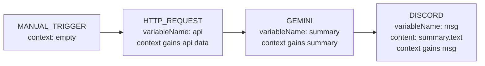

# Node Types

NodeBase supports 10 node types divided into three categories: **Triggers** (entry points), **Actions** (processing), and **Outputs** (destinations). Every workflow must begin with exactly one trigger node.

**Node registry:** `src/config/node-components/index.ts`  
**Executor registry:** `src/features/executions/lib/executor-registry/index.ts`

---

## Table of Contents

1. [Node Anatomy](#1-node-anatomy)
2. [Triggers](#2-triggers)
   - [INITIAL](#initial)
   - [MANUAL_TRIGGER](#manual_trigger)
   - [GOOGLE_FORM_TRIGGER](#google_form_trigger)
   - [STRIPE_TRIGGER](#stripe_trigger)
3. [Actions](#3-actions)
   - [HTTP_REQUEST](#http_request)
   - [GEMINI](#gemini)
   - [OPENAI](#openai)
   - [ANTHROPIC](#anthropic)
4. [Outputs](#4-outputs)
   - [DISCORD](#discord)
   - [SLACK](#slack)
5. [Context Propagation](#5-context-propagation)
6. [Adding a New Node Type](#6-adding-a-new-node-type)

---

## 1. Node Anatomy

Every node has the same database structure regardless of type:

```typescript
interface Node {
  id: string;          // CUID — also the React Flow node ID
  workflowId: string;  // Parent workflow
  type: NodeType;      // One of 10 enum values
  position: {          // Canvas coordinates
    x: number;
    y: number;
  };
  data: {              // Type-specific configuration (validated by Zod in dialog)
    [key: string]: unknown;
  };
  credentialId?: string; // AI nodes: reference to encrypted API key
}
```

The `data` field stores all node-specific configuration. Its shape varies by node type and is validated in the node's configuration dialog using React Hook Form + Zod.

**Node execution interface:**
```typescript
interface NodeExecutorParams<TData = Record<string, unknown>> {
  data: TData;                    // Typed node configuration
  nodeId: string;                 // Used for Realtime channel publishing
  userId: string;                 // For credential lookup
  context: WorkflowContext;       // Accumulated outputs from prior nodes
  step: StepTools;                // Inngest step tools (step.run, step.sleep, etc.)
  publish: Realtime.PublishFn;    // Publishes status to Inngest Realtime channel
}

type WorkflowContext = Record<string, unknown>;
type NodeExecutor = (params: NodeExecutorParams) => Promise<WorkflowContext>;
```

---

## 2. Triggers

### INITIAL

**File:** Auto-created on workflow creation  
**Executor:** `src/features/triggers/components/manual-trigger/executor/index.ts`

The `INITIAL` node is a placeholder automatically created when a user creates a new workflow. It is replaced by the first trigger type the user selects from the node selector. If it is never replaced, the workflow cannot be executed.

| Property | Value |
|----------|-------|
| Credential required | No |
| Execution | Pass-through (returns context unchanged) |
| Can have multiple | No |

**Data schema:** None (no configuration)

---

### MANUAL_TRIGGER

**Component:** `src/features/triggers/components/manual-trigger/`  
**Executor:** `src/features/triggers/components/manual-trigger/executor/index.ts`  
**Realtime channel:** `manual-trigger-execution`

The manual trigger allows users to execute a workflow directly from the editor by clicking the "Execute" button. It is the simplest trigger — it passes the initial context through unchanged.

| Property | Value |
|----------|-------|
| Credential required | No |
| Inputs consumed | None |
| Output context | Same as input (pass-through) |
| Realtime status | loading → success |

**Data schema:**
```typescript
// No required fields. Dialog has no configuration.
{}
```

**Execution logic:**
```
1. Publish status: "loading"
2. Run step.run("manual-trigger", () => context)
3. Publish status: "success"
4. Return context unchanged
```

**Example configuration JSON:**
```json
{}
```

**How to use:**
1. Add a Manual Trigger node to your workflow
2. Connect it to subsequent action nodes
3. Click "Execute" in the editor toolbar

---

### GOOGLE_FORM_TRIGGER

**Component:** `src/features/triggers/components/google-form-trigger/`  
**Executor:** `src/features/triggers/components/google-form-trigger/executor/index.ts`  
**Realtime channel:** `google-form-trigger-execution`

Triggers a workflow when a Google Form receives a submission. The submission data is pre-populated in the workflow context under `initialData.googleForm`.

| Property | Value |
|----------|-------|
| Credential required | No |
| Inputs consumed | `initialData.googleForm` (from webhook) |
| Output context | Pass-through (trigger data already in context) |
| Realtime status | loading → success |

**Webhook endpoint:** `POST /api/webhooks/google-form?workflowId=YOUR_WORKFLOW_ID`

**Context data available** (at `initialData.googleForm`):
```typescript
{
  formId: string;
  formTitle: string;
  responseId: string;
  timestamp: string;           // ISO 8601
  respondentEmail: string;
  responses: Record<string, unknown>;  // Question title → answer value
}
```

**Data schema:**
```typescript
// No required fields. Webhook URL is displayed in dialog.
{}
```

**Example Handlebars reference in downstream nodes:**
```
Summarize this response: {{initialData.googleForm.responses}}
Submitted by: {{initialData.googleForm.respondentEmail}}
```

**Setup:**
1. Add a Google Form Trigger node to your workflow
2. Copy the webhook URL from the node's configuration dialog
3. Configure your Google Form to send submissions to that URL (via Google Apps Script or Zapier)

---

### STRIPE_TRIGGER

**Component:** `src/features/triggers/components/stripe-trigger/`  
**Executor:** `src/features/triggers/components/stripe-trigger/executor/index.ts`  
**Realtime channel:** `stripe-trigger-execution`

Triggers a workflow when Stripe sends a webhook event (e.g., payment completed, subscription created).

| Property | Value |
|----------|-------|
| Credential required | No |
| Inputs consumed | `initialData.stripe` (from webhook) |
| Output context | Pass-through (trigger data already in context) |
| Realtime status | loading → success |

**Webhook endpoint:** `POST /api/webhooks/stripe?workflowId=YOUR_WORKFLOW_ID`

**Context data available** (at `initialData.stripe`):
```typescript
{
  eventId: string;      // e.g., "evt_1NirD82eZvKYlo2C..."
  eventType: string;    // e.g., "payment_intent.succeeded"
  timestamp: number;    // Unix timestamp
  livemode: boolean;    // false in test mode
  data: unknown;        // Full Stripe event data object
}
```

**Data schema:**
```typescript
{}  // No configuration needed
```

**Example Handlebars reference:**
```
New payment received! Event: {{initialData.stripe.eventType}}
Amount: {{initialData.stripe.data.object.amount}}
```

**Setup:**
1. Add a Stripe Trigger node to your workflow
2. Copy the webhook URL from the node's configuration dialog
3. Go to Stripe Dashboard → Developers → Webhooks → Add endpoint
4. Paste the webhook URL and select the events you want to receive

---

## 3. Actions

### HTTP_REQUEST

**Component:** `src/features/executions/components/http-request/`  
**Executor:** `src/features/executions/components/http-request/executor/index.ts`  
**Realtime channel:** `http-request-execution`  
**HTTP client:** `ky`

Makes an HTTP request to any external API. Supports Handlebars templating in the endpoint URL and request body to inject values from prior nodes.

| Property | Value |
|----------|-------|
| Credential required | No |
| Methods supported | GET, POST, PUT, DELETE, PATCH |
| Templating | Handlebars in endpoint and body |
| Realtime status | loading → success / error |

**Data schema (Zod):**
```typescript
{
  variableName: string;       // Key to store response in context
  endpoint: string;           // URL (supports Handlebars: "https://api.example.com/{{userId}}")
  method: "GET" | "POST" | "PUT" | "DELETE" | "PATCH";
  body?: string;              // JSON body as string (supports Handlebars)
}
```

**Output context** (stored at `context[variableName]`):
```typescript
{
  httpResponse: {
    status: number;         // HTTP status code
    statusText: string;     // e.g., "OK"
    data: unknown;          // Parsed JSON response body
  }
}
```

**Example configuration:**
```json
{
  "variableName": "weatherData",
  "endpoint": "https://api.weatherapi.com/v1/current.json?key=API_KEY&q=London",
  "method": "GET"
}
```

**Downstream reference:**
```
Current temperature: {{weatherData.httpResponse.data.current.temp_c}}°C
```

---

### GEMINI

**Component:** `src/features/executions/components/gemini/`  
**Executor:** `src/features/executions/components/gemini/executor/index.ts`  
**Realtime channel:** `gemini-execution`  
**Model:** `gemini-2.5-flash` via `@ai-sdk/google`

Generates text using Google's Gemini Flash model. Supports system and user prompts with Handlebars context injection.

| Property | Value |
|----------|-------|
| Credential required | Yes (GEMINI type) |
| Model | gemini-2.5-flash |
| Templating | Handlebars in both prompts |
| Telemetry | Input/output recording enabled |
| Realtime status | loading → success / error |

**Data schema (Zod):**
```typescript
{
  variableName: string;       // Key to store AI response in context
  credentialId: string;       // ID of GEMINI credential
  systemPrompt?: string;      // Optional system instructions (Handlebars)
  userPrompt: string;         // Required user message (Handlebars)
}
```

**Output context** (stored at `context[variableName]`):
```typescript
{
  text: string;  // Generated text response
}
```

**Example configuration:**
```json
{
  "variableName": "summary",
  "credentialId": "cm_abc123",
  "systemPrompt": "You are a professional summarizer. Be concise.",
  "userPrompt": "Summarize the following data: {{weatherData.httpResponse.data}}"
}
```

**Downstream reference:**
```
AI Summary: {{summary.text}}
```

---

### OPENAI

**Component:** `src/features/executions/components/openai/`  
**Executor:** `src/features/executions/components/openai/executor/index.ts`  
**Realtime channel:** `openai-execution`  
**Model:** `gpt-4` via `@ai-sdk/openai`

Generates text using OpenAI's GPT-4 model. Interface identical to GEMINI.

| Property | Value |
|----------|-------|
| Credential required | Yes (OPENAI type) |
| Model | gpt-4 |
| Templating | Handlebars in both prompts |
| Telemetry | Input/output recording enabled |
| Realtime status | loading → success / error |

**Data schema (Zod):**
```typescript
{
  variableName: string;
  credentialId: string;       // ID of OPENAI credential
  systemPrompt?: string;
  userPrompt: string;
}
```

**Output context:**
```typescript
{
  text: string;
}
```

**Example configuration:**
```json
{
  "variableName": "classification",
  "credentialId": "cm_def456",
  "systemPrompt": "Classify the sentiment as positive, negative, or neutral.",
  "userPrompt": "{{formResponse.text}}"
}
```

---

### ANTHROPIC

**Component:** `src/features/executions/components/anthropic/`  
**Executor:** `src/features/executions/components/anthropic/executor/index.ts`  
**Realtime channel:** `anthropic-execution`  
**Model:** `claude-sonnet-4-5` via `@ai-sdk/anthropic`

Generates text using Anthropic's Claude Sonnet model. Interface identical to GEMINI and OPENAI.

| Property | Value |
|----------|-------|
| Credential required | Yes (ANTHROPIC type) |
| Model | claude-sonnet-4-5 |
| Templating | Handlebars in both prompts |
| Telemetry | Input/output recording enabled |
| Realtime status | loading → success / error |

**Data schema (Zod):**
```typescript
{
  variableName: string;
  credentialId: string;       // ID of ANTHROPIC credential
  systemPrompt?: string;
  userPrompt: string;
}
```

**Output context:**
```typescript
{
  text: string;
}
```

**Example configuration:**
```json
{
  "variableName": "analysis",
  "credentialId": "cm_ghi789",
  "systemPrompt": "You are an expert business analyst. Provide actionable insights.",
  "userPrompt": "Analyze this customer feedback: {{summary.text}}"
}
```

---

## 4. Outputs

### DISCORD

**Component:** `src/features/executions/components/discord/`  
**Executor:** `src/features/executions/components/discord/executor/index.ts`  
**Realtime channel:** `discord-execution`

Sends a message to a Discord channel via a Discord Incoming Webhook.

| Property | Value |
|----------|-------|
| Credential required | No (webhook URL in config) |
| Max message length | 2000 characters (Discord limit) |
| Templating | Handlebars in content and username |
| HTML entities | Decoded automatically |
| Realtime status | loading → success / error |

**Data schema (Zod):**
```typescript
{
  variableName: string;       // Key to store sent message in context
  webhookUrl: string;         // Discord webhook URL
  content: string;            // Message content (Handlebars, max 2000 chars)
  username?: string;          // Override bot name (Handlebars)
}
```

**Output context** (stored at `context[variableName]`):
```typescript
{
  messageContent: string;  // Actual sent message (truncated to 2000 chars)
}
```

**Example configuration:**
```json
{
  "variableName": "discordNotification",
  "webhookUrl": "https://discord.com/api/webhooks/123456/abc...",
  "content": "New analysis complete!\n\n{{analysis.text}}",
  "username": "NodeBase Bot"
}
```

**Setup:**
1. Go to your Discord server → Server Settings → Integrations → Webhooks
2. Create a new webhook for the target channel
3. Copy the webhook URL into the node configuration

---

### SLACK

**Component:** `src/features/executions/components/slack/`  
**Executor:** `src/features/executions/components/slack/executor/index.ts`  
**Realtime channel:** `slack-execution`

Sends a message to a Slack channel via a Slack Incoming Webhook.

| Property | Value |
|----------|-------|
| Credential required | No (webhook URL in config) |
| Max message length | 2000 characters |
| Templating | Handlebars in content |
| HTML entities | Decoded automatically |
| Realtime status | loading → success / error |

**Data schema (Zod):**
```typescript
{
  variableName: string;       // Key to store sent message in context
  webhookUrl: string;         // Slack webhook URL
  content: string;            // Message content (Handlebars, max 2000 chars)
}
```

**Output context** (stored at `context[variableName]`):
```typescript
{
  messageContent: string;
}
```

**Example configuration:**
```json
{
  "variableName": "slackAlert",
  "webhookUrl": "https://hooks.slack.com/services/T.../B.../...",
  "content": ":robot_face: Workflow complete!\n\n*Summary:* {{summary.text}}"
}
```

**Setup:**
1. Go to [api.slack.com/apps](https://api.slack.com/apps) → Create New App → From Scratch
2. Enable Incoming Webhooks → Add New Webhook to Workspace
3. Select channel and copy the webhook URL

---

## 5. Context Propagation

All nodes share a mutable `context` object that accumulates throughout workflow execution. Each node reads from and writes to this context.



### Handlebars Templating

String fields in node configurations support Handlebars templates. At execution time, the current `context` is passed as the Handlebars data object.

```handlebars
{{variableName.field}}                    {{! Simple path }}
{{initialData.googleForm.respondentEmail}} {{! Nested path }}
{{#each items}}{{this}}{{/each}}          {{! Iteration }}
{{#if condition}}text{{/if}}              {{! Conditionals }}
```

**Available in:** endpoint URL, request body (HTTP_REQUEST), system prompt, user prompt (AI nodes), content (Discord, Slack).

---

## 6. Adding a New Node Type

To add a new node type to NodeBase:

1. **Add to enum** in `prisma/schema.prisma`:
   ```prisma
   enum NodeType {
     // ...existing types...
     MY_NEW_NODE
   }
   ```

2. **Create migration:**
   ```bash
   npx prisma migrate dev --name add_my_new_node_type
   ```

3. **Create executor** at `src/features/executions/components/my-new-node/executor/index.ts`:
   ```typescript
   import type { NodeExecutor } from "@/features/executions/types";

   export const myNewNodeExecutor: NodeExecutor = async ({
     data, nodeId, userId, context, step, publish,
   }) => {
     await publish(channel, topic("status"), { nodeId, status: "loading" });
     const result = await step.run("my-new-node", async () => {
       // ... your logic ...
       return { text: "result" };
     });
     await publish(channel, topic("status"), { nodeId, status: "success" });
     return { ...context, [data.variableName]: result };
   };
   ```

4. **Create Inngest channel** at `src/inngest/channels/my-new-node/index.ts`

5. **Register executor** in `src/features/executions/lib/executor-registry/index.ts`:
   ```typescript
   [NodeType.MY_NEW_NODE]: myNewNodeExecutor,
   ```

6. **Create React component** at `src/features/executions/components/my-new-node/node/index.tsx`

7. **Create config dialog** at `src/features/executions/components/my-new-node/dialog/index.tsx`

8. **Register component** in `src/config/node-components/index.ts`:
   ```typescript
   MY_NEW_NODE: MyNewNode,
   ```

9. **Add to NodeSelector** in `src/components/node-selector/index.tsx`
