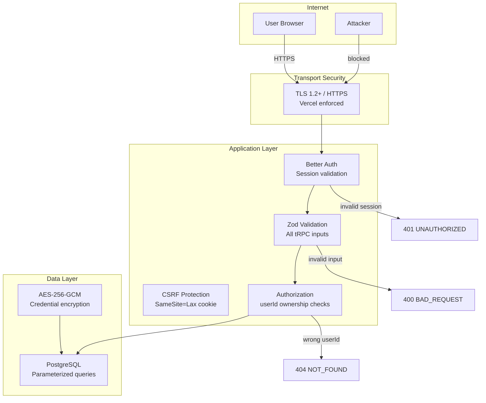
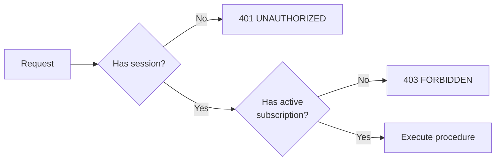

# Security Architecture

This document describes NodeBase's security posture, controls, threat model, and OWASP Top 10 mapping.

---

## Table of Contents

1. [Security Layers Overview](#1-security-layers-overview)
2. [Authentication Security](#2-authentication-security)
3. [Credential Encryption](#3-credential-encryption)
4. [Authorization Model](#4-authorization-model)
5. [Input Validation](#5-input-validation)
6. [Transport Security](#6-transport-security)
7. [OWASP Top 10 Mapping](#7-owasp-top-10-mapping)
8. [Threat Model](#8-threat-model)
9. [Production Hardening Checklist](#9-production-hardening-checklist)

---

## 1. Security Layers Overview



---

## 2. Authentication Security

### Session Management

| Property | Value | Justification |
|----------|-------|---------------|
| Cookie flags | `HttpOnly; SameSite=Lax; Secure` | Prevents XSS access; CSRF mitigation |
| Token storage | Database-backed | Allows server-side revocation |
| Token type | Cryptographically random string | Not JWT — no key management risk |
| Session expiry | Configured by Better Auth (default: 30 days) | Balance UX and security |

**Why not JWT?** Better Auth uses database-backed sessions by default. This allows:
- Immediate revocation (logout works instantly)
- No JWT signing key management
- User enumeration prevention

### Password Security

Passwords are hashed with `bcrypt` at a cost factor of 10 (Better Auth default):
- Salted automatically (bcrypt includes salt in output)
- Time-constant comparison (prevents timing attacks)
- Minimum entropy not enforced (consider adding for production)

### OAuth Security

- **State parameter** — Validated on callback to prevent CSRF
- **Trusted origins** — Validated to prevent open redirects
- **Code exchange** — Happens server-side (not in browser)
- **Access tokens** — Stored encrypted in `Account` table

---

## 3. Credential Encryption

**Algorithm:** AES-256-GCM (Authenticated Encryption)  
**Key size:** 256 bits (32 bytes, stored as 64 hex chars)  
**IV:** Random per encryption call (12 bytes for GCM)  
**Authentication tag:** 16 bytes, appended to ciphertext

```
Stored ciphertext format:
┌─────────────────────────────────────────────────────┐
│  IV (24 hex chars)  │  Auth Tag (32 hex chars)  │  Ciphertext  │
└─────────────────────────────────────────────────────┘
```

**Why AES-256-GCM?**
- GCM provides authentication (detects tampering) — pure encryption modes like CBC do not
- 256-bit key exceeds current attack capabilities
- NIST-recommended for symmetric encryption

**Key storage:**
- `ENCRYPTION_KEY` is stored as an environment variable
- Never committed to version control
- In Vercel: stored in encrypted environment variable store
- Never logged or exposed in API responses

**Key rotation procedure** (not yet automated — should be implemented):
1. Fetch all credentials from DB
2. Decrypt with current key
3. Re-encrypt with new key
4. Update all records in a transaction
5. Swap env var value
6. Deploy

---

## 4. Authorization Model

### Resource Ownership

Every user-owned resource has a `userId` field that is always included in database queries:

```typescript
// Correct — user can only access their own workflows
db.workflow.findUnique({
  where: { id: workflowId, userId: session.user.id },
})

// Incorrect pattern (never used) — would allow any user to access any workflow
db.workflow.findUnique({
  where: { id: workflowId },
})
```

**Resources with ownership checks:**
- `Workflow` — `userId` filter on all queries
- `Credential` — `userId` filter + ownership check before decrypt
- `Execution` — `workflowId` → `workflow.userId` join check

### Subscription-based Access

Premium features are gated at the tRPC procedure level:



**Premium procedures:**
- `workflows.create` — Creating new workflows
- `credentials.create` — Creating new credentials

**Protected-only procedures:**
- All other `workflows.*`, `credentials.*`, `executions.*`

---

## 5. Input Validation

All tRPC procedure inputs are validated with Zod schemas before any business logic runs.

**Examples:**

```typescript
// workflows.getMany
z.object({
  page: z.number().int().min(1).default(1),
  pageSize: z.number().int().min(1).max(100).default(5),
  search: z.string().default(""),
})

// credentials.create
z.object({
  name: z.string().min(1),
  value: z.string().min(1),
  type: z.enum(["OPENAI", "ANTHROPIC", "GEMINI"]),
})
```

Invalid inputs return `TRPCError: BAD_REQUEST` before reaching the database.

**Prisma parameterized queries:** All database queries use Prisma's parameterized query builder, which prevents SQL injection by construction.

**Handlebars injection:** Node configuration fields use Handlebars templating. Handlebars HTML-escapes output by default (`{{ }}` escapes, `{{{ }}}` does not). For non-HTML contexts (API URLs, message text), HTML entity decoding is applied separately using `html-entities`.

---

## 6. Transport Security

| Layer | Control |
|-------|---------|
| HTTPS | Enforced by Vercel (HTTP → HTTPS redirect) |
| TLS version | TLS 1.2+ (Vercel default) |
| HSTS | Set by Vercel for `.vercel.app` domains |
| Database | TLS required (`sslmode=require` in DATABASE_URL) |
| AI API calls | HTTPS enforced by provider SDKs |
| Webhook delivery | HTTPS required for production endpoints |

**Sentry tunnel:** Events are sent through `/monitoring` on your own domain rather than directly to Sentry, avoiding ad blocker interference.

---

## 7. OWASP Top 10 Mapping

| # | OWASP Risk | NodeBase Control | Status |
|---|-----------|-----------------|--------|
| A01 | Broken Access Control | userId ownership checks on all queries; premiumProcedure for subscription-gated features | Mitigated |
| A02 | Cryptographic Failures | AES-256-GCM for credentials; bcrypt for passwords; TLS for transport | Mitigated |
| A03 | Injection | Prisma parameterized queries (SQL); Zod validation (input); Handlebars HTML-escaping (template) | Mitigated |
| A04 | Insecure Design | Auth/authz at API layer; credential ownership verified before decrypt; secrets in env vars | Mitigated |
| A05 | Security Misconfiguration | `.env` not committed; strict TypeScript; Biome linting | Partially mitigated |
| A06 | Vulnerable Components | npm dependencies; should have regular `npm audit` and Dependabot | Needs automation |
| A07 | Identity Auth Failures | Better Auth with HttpOnly cookies; no JWT secret exposure; SameSite CSRF mitigation | Mitigated |
| A08 | Software Integrity Failures | Semantic Release with signed commits; CI/CD pipeline | Partially mitigated |
| A09 | Security Logging & Monitoring | Sentry error tracking; Inngest execution logs; execution DB records | Partially mitigated |
| A10 | Server-side Request Forgery | HTTP_REQUEST node makes arbitrary requests — SSRF risk exists | **Needs attention** |

### A10 SSRF Risk (HTTP_REQUEST node)

The `HTTP_REQUEST` node allows users to make HTTP requests to arbitrary URLs. This is intentional (it's the purpose of the node) but creates SSRF risk if attackers craft URLs pointing to internal services.

**Current mitigations:**
- User must be authenticated to execute workflows
- User must own the workflow

**Recommended additional controls:**
```typescript
// Add URL validation to httpRequestExecutor
function validateEndpoint(url: string): void {
  const parsed = new URL(url);

  // Block private IP ranges
  const BLOCKED_HOSTS = /^(localhost|127\.|10\.|172\.(1[6-9]|2\d|3[01])\.|192\.168\.)/;
  if (BLOCKED_HOSTS.test(parsed.hostname)) {
    throw new Error("Requests to private IP ranges are not allowed");
  }

  // Only allow HTTPS in production
  if (process.env.NODE_ENV === "production" && parsed.protocol !== "https:") {
    throw new Error("Only HTTPS endpoints are allowed");
  }
}
```

---

## 8. Threat Model

### Assets

| Asset | Sensitivity | Protection |
|-------|-------------|-----------|
| User credentials (AI API keys) | Critical | AES-256-GCM encryption |
| Auth session tokens | High | HttpOnly cookies, DB-backed |
| Workflow definitions | Medium | Authentication + ownership |
| Execution outputs | Medium | Authentication + ownership |
| User email addresses | Medium | DB access control, TLS |
| Auth secrets (BETTER_AUTH_SECRET) | Critical | Environment variable |
| Encryption key (ENCRYPTION_KEY) | Critical | Environment variable |

### Threat Actors

| Actor | Capability | Goal |
|-------|-----------|------|
| External attacker (unauthenticated) | Network access | Access any data |
| Authenticated user (malicious) | Valid session | Access other users' data |
| Compromised dependency | Code execution | Exfiltrate secrets |
| Database breach | DB read access | Read encrypted credentials |

### Attack Surface

| Entry Point | Controls |
|-------------|---------|
| `/api/auth/*` | Better Auth rate limiting, CSRF state |
| `/api/trpc/*` | Session validation, Zod input validation |
| `/api/inngest` | Inngest signing key verification |
| `/api/webhooks/stripe` | No auth (public) — tied to workflowId |
| `/api/webhooks/google-form` | No auth (public) — tied to workflowId |

**Webhook security note:** The webhook endpoints are unauthenticated (Stripe/Google Forms don't authenticate to our server). An attacker who knows a `workflowId` can trigger workflow execution with arbitrary data. Consider:
- Adding a shared secret validation for webhooks
- Rate limiting webhook endpoints

---

## 9. Production Hardening Checklist

### Application

- [ ] `ENCRYPTION_KEY` is unique per environment (dev ≠ prod)
- [ ] `BETTER_AUTH_SECRET` is unique per environment
- [ ] No secrets in `.env` committed to git
- [ ] `SENTRY_AUTH_TOKEN` scoped to minimum permissions
- [ ] HTTP_REQUEST node SSRF mitigations implemented
- [ ] Webhook endpoints have rate limiting

### Infrastructure

- [ ] Vercel HTTPS enforced (redirect enabled)
- [ ] Neon database in same region as Vercel deployment
- [ ] Neon IP allowlist configured (restrict to Vercel IPs)
- [ ] Database password is strong and unique

### Dependencies

- [ ] `npm audit` run — no high/critical vulnerabilities
- [ ] Dependabot configured for automated dependency updates
- [ ] `npm ci` (not `npm install`) used in CI

### Monitoring

- [ ] Sentry alerts configured for error spikes
- [ ] Failed execution alert webhook configured
- [ ] Unusual traffic patterns alert configured

### Access Control

- [ ] Production Polar.sh access token is production (not sandbox)
- [ ] GitHub/Google OAuth apps restricted to specific callback URLs
- [ ] Inngest signing key rotated after any suspected compromise
