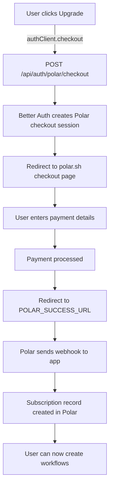

# Subscriptions & Billing

NodeBase uses [Polar.sh](https://polar.sh) for subscription billing. Polar is integrated directly into Better Auth via the `@polar-sh/better-auth` plugin.

**Polar SDK:** `src/lib/polar.ts`  
**Auth integration:** `src/lib/auth.ts`  
**Auth client:** `src/lib/auth-client.ts`  
**Subscription hooks:** `src/features/subscriptons/hooks/use-subscription.ts`

---

## Table of Contents

1. [Architecture Overview](#1-architecture-overview)
2. [Subscription Tiers](#2-subscription-tiers)
3. [Subscription Gates](#3-subscription-gates)
4. [Polar.sh Configuration](#4-polarsh-configuration)
5. [Checkout Flow](#5-checkout-flow)
6. [Customer Portal](#6-customer-portal)
7. [Checking Subscription State](#7-checking-subscription-state)
8. [Sandbox vs Production](#8-sandbox-vs-production)

---

## 1. Architecture Overview

```mermaid
sequenceDiagram
    participant User as Browser
    participant App as NodeBase (Better Auth)
    participant Polar as Polar.sh

    User->>App: Click "Upgrade to Pro"
    App->>Polar: Create checkout session
    Polar-->>App: Checkout URL
    App-->>User: redirect to Polar checkout

    User->>Polar: Complete payment
    Polar-->>User: redirect to POLAR_SUCCESS_URL
    Polar->>App: Webhook: subscription.created

    User->>App: Click "Create Workflow"
    App->>Polar: getCustomerByExternalId(userId)
    Polar-->>App: Customer { subscriptions: [{ status: "active" }] }
    App->>App: premiumProcedure check passes
    App-->>User: Workflow created
```



---

## 2. Subscription Tiers

| Feature | Free | Pro |
|---------|------|-----|
| View workflows | Yes | Yes |
| View credentials | Yes | Yes |
| View executions | Yes | Yes |
| Create workflows | No | Yes |
| Create credentials | No | Yes |
| Execute workflows | Yes* | Yes |
| Editor access | Yes | Yes |

\* Execution is not subscription-gated, but workflows can only be created on Pro.

---

## 3. Subscription Gates

Premium features are enforced at the tRPC procedure level using `premiumProcedure`:

```typescript
// src/trpc/init.ts
export const premiumProcedure = protectedProcedure.use(async ({ ctx, next }) => {
  const customerState = await auth.api.polar.getCustomerState({
    userId: ctx.session.user.id,
  });

  const hasActiveSubscription = customerState?.subscriptions?.some(
    (sub) => sub.status === "active"
  );

  if (!hasActiveSubscription) {
    throw new TRPCError({
      code: "FORBIDDEN",
      message: "This feature requires a Pro subscription",
    });
  }

  return next({ ctx });
});
```

**Gated procedures:**
- `workflows.create` — Cannot create new workflows without subscription
- `credentials.create` — Cannot create new credentials without subscription

**Not gated:**
- `workflows.getMany/getOne/update/remove/execute` — Existing workflows remain accessible
- `credentials.getMany/getOne/update/remove` — Existing credentials remain accessible
- `executions.*` — Execution history always accessible

### Frontend Enforcement

The UI also checks subscription state to show/hide the "Upgrade to Pro" button and upsell modal:

```typescript
// src/features/subscriptons/hooks/use-subscription.ts
export function useHasActiveSubscription() {
  const { data: session } = authClient.useSession();
  const customerId = session?.user?.id;

  // Uses Polar plugin's customer state endpoint
  const { data: customerState } = authClient.polar.useCustomerState();

  const hasSubscription = customerState?.subscriptions?.some(
    (sub) => sub.status === "active"
  );

  return { hasSubscription, customerState };
}
```

---

## 4. Polar.sh Configuration

### SDK Client

```typescript
// src/lib/polar.ts
import { Polar } from "@polar-sh/sdk";

export const polar = new Polar({
  accessToken: process.env.POLAR_ACCESS_TOKEN!,
  server: "sandbox",  // Change to "production" for live
});
```

### Better Auth Plugin

```typescript
// src/lib/auth.ts
import {
  polar as polarPlugin,
  checkout as polarCheckout,
  portal as polarPortal,
  usage as polarUsage,
} from "@polar-sh/better-auth";

export const auth = betterAuth({
  // ...
  plugins: [
    polarPlugin({
      client: polar,
      createCustomerOnSignUp: true,
      use: [
        polarCheckout({
          products: [
            {
              productId: "50c35c06-c53f-4a20-ba55-b7bffb0e2891",
              slug: "pro",
            },
          ],
          successUrl: `${process.env.POLAR_SUCCESS_URL}/`,
          authenticateWith: "session",
          checkout: { enabled: true },
        }),
        polarPortal(),
        polarUsage(),
      ],
    }),
  ],
});
```

**What each plugin does:**

| Plugin | Purpose |
|--------|---------|
| `polarPlugin` | Base integration: customer creation, state sync |
| `polarCheckout` | Checkout session creation, redirect flow |
| `polarPortal` | Customer billing portal (manage subscription, invoices) |
| `polarUsage` | Usage-based billing tracking (if needed) |

---

## 5. Checkout Flow

### Triggering Checkout

In the UI (sidebar "Upgrade to Pro" button):

```typescript
const handleUpgrade = async () => {
  await authClient.checkout({ slug: "pro" });
  // Better Auth redirects to Polar checkout page
};
```

### Checkout Steps



### Success URL

After successful checkout, Polar redirects to `POLAR_SUCCESS_URL`:
- Development: `http://localhost:3000`
- Production: `https://your-domain.com`

---

## 6. Customer Portal

Users can manage their subscription (cancel, update payment method, view invoices) via the Polar customer portal:

```typescript
// Sidebar billing button
const handleBilling = async () => {
  await authClient.portal();
  // Redirects to Polar customer portal
};
```

The portal is accessed via `POST /api/auth/polar/portal` and redirects to `polar.sh/portal/...`.

---

## 7. Checking Subscription State

### Server-side (in tRPC procedures)

```typescript
// Called inside premiumProcedure
const customerState = await auth.api.polar.getCustomerState({
  userId: session.user.id,
});

const isSubscribed = customerState?.subscriptions?.some(
  (sub) => sub.status === "active"
);
```

### Client-side (in React components)

```typescript
import { useHasActiveSubscription } from "@/features/subscriptons/hooks/use-subscription";

function UpgradeButton() {
  const { hasSubscription } = useHasActiveSubscription();

  if (hasSubscription) {
    return <Button onClick={openBillingPortal}>Manage Billing</Button>;
  }

  return <Button onClick={handleUpgrade}>Upgrade to Pro</Button>;
}
```

### Subscription Statuses

| Polar Status | Meaning | Has Access? |
|-------------|---------|-------------|
| `active` | Subscription is paid and current | Yes |
| `canceled` | User canceled, still within billing period | Depends (check `currentPeriodEnd`) |
| `past_due` | Payment failed | No |
| `unpaid` | Multiple failed payments | No |
| `incomplete` | Checkout not completed | No |

---

## 8. Sandbox vs Production

Polar.sh has separate sandbox and production environments.

### Switching to Production

1. Update `src/lib/polar.ts`:
   ```typescript
   export const polar = new Polar({
     accessToken: process.env.POLAR_ACCESS_TOKEN!,
     server: "production",  // Change from "sandbox"
   });
   ```

2. Create a production product in [polar.sh](https://polar.sh) (not sandbox)

3. Update the product ID in `src/lib/auth.ts`:
   ```typescript
   productId: "your-production-product-id",
   ```

4. Update `POLAR_ACCESS_TOKEN` in your environment to the **production** access token (not sandbox)

5. Update `POLAR_SUCCESS_URL` to your production domain

### Sandbox Testing

In sandbox mode:
- Use Polar's test card numbers for checkout
- Subscriptions are simulated — no real charges
- Webhooks are delivered as normal (can test full flow)
- Customer portal shows simulated subscription data

### Test Checkout (Sandbox)

Use these test card details in the Polar sandbox checkout:
- Card: `4242 4242 4242 4242`
- Expiry: Any future date
- CVC: Any 3 digits
