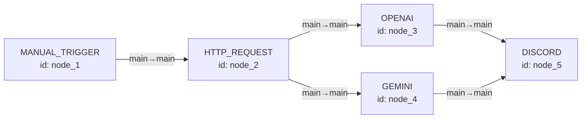
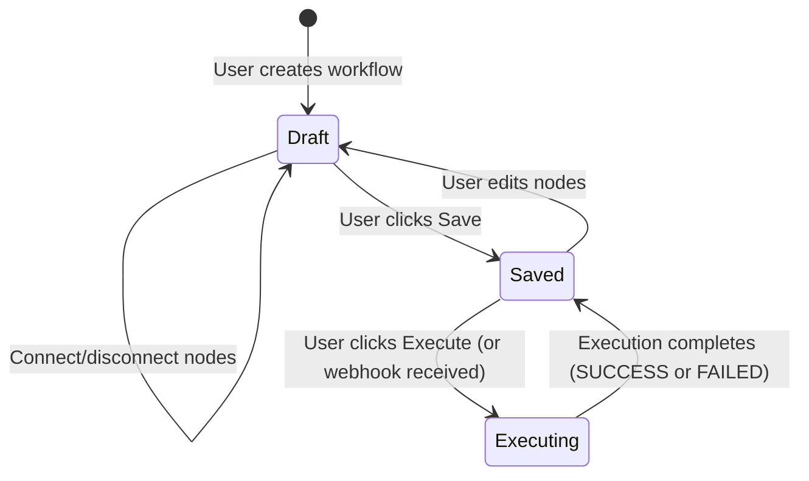
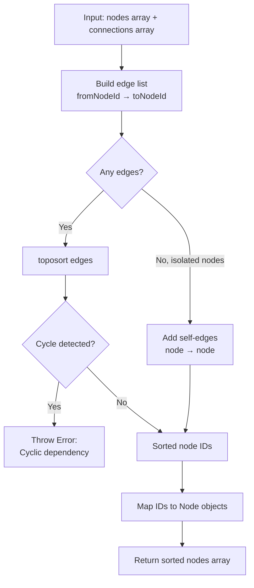
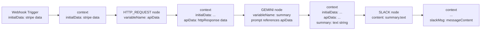
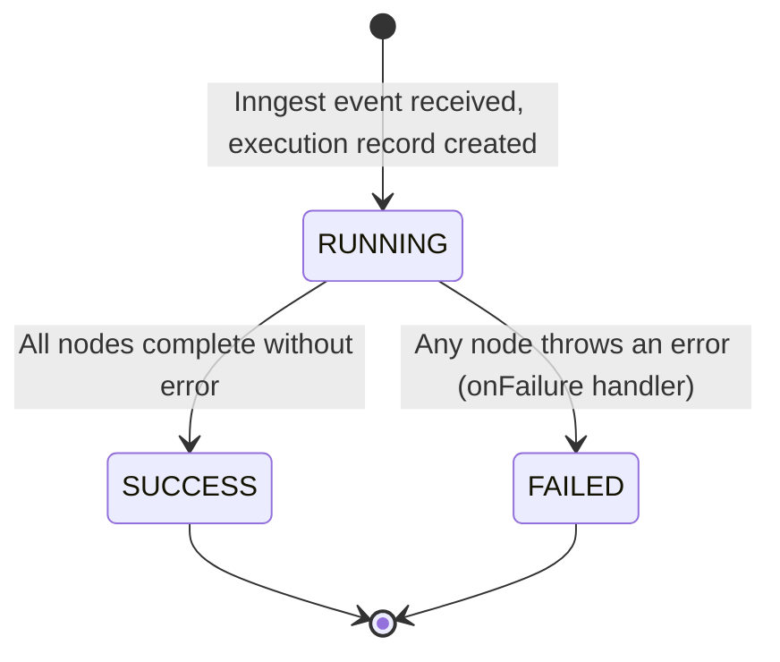

# Workflow System

This document explains the complete workflow system: how workflows are represented, how the execution engine works, and how data flows between nodes.

---

## Table of Contents

1. [Workflow Data Model](#1-workflow-data-model)
2. [Workflow Lifecycle](#2-workflow-lifecycle)
3. [Execution Engine](#3-execution-engine)
4. [Topological Sort](#4-topological-sort)
5. [Context System](#5-context-system)
6. [Execution State Machine](#6-execution-state-machine)
7. [Error Handling](#7-error-handling)
8. [Real-time Status](#8-real-time-status)
9. [Saving Workflows](#9-saving-workflows)

---

## 1. Workflow Data Model

A workflow is a **Directed Acyclic Graph (DAG)** where:
- **Nodes** are the processing units (triggers, AI, actions, outputs)
- **Connections** are directed edges from one node's output to another's input



**Database representation:**

```sql
-- Nodes
id       | type           | position          | data
---------|----------------|-------------------|---------------------
node_1   | MANUAL_TRIGGER | {"x":0,"y":0}     | {}
node_2   | HTTP_REQUEST   | {"x":200,"y":0}   | {"endpoint":"...","method":"GET","variableName":"api"}
node_3   | OPENAI         | {"x":400,"y":-80} | {"userPrompt":"...","variableName":"summary"}
node_4   | GEMINI         | {"x":400,"y":80}  | {"userPrompt":"...","variableName":"altSummary"}
node_5   | DISCORD        | {"x":600,"y":0}   | {"webhookUrl":"...","content":"{{summary.text}}"}

-- Connections
fromNodeId | toNodeId | fromOutput | toInput
-----------|----------|------------|--------
node_1     | node_2   | main       | main
node_2     | node_3   | main       | main
node_2     | node_4   | main       | main
node_3     | node_5   | main       | main
node_4     | node_5   | main       | main
```

**React Flow format** (returned by `workflows.getOne`):

```typescript
{
  nodes: [
    { id: "node_1", type: "MANUAL_TRIGGER", position: { x: 0, y: 0 }, data: {} },
    // ...
  ],
  edges: [
    { id: "conn_1", source: "node_1", target: "node_2", sourceHandle: "main", targetHandle: "main" },
    // ...
  ]
}
```

---

## 2. Workflow Lifecycle



**Creating a workflow:**

1. User clicks "New Workflow" → calls `workflows.create` (premium)
2. Database creates: Workflow record + one `INITIAL` node
3. User is redirected to `/workflows/{id}/editor`
4. User selects a trigger node type from the node selector, replacing the INITIAL node
5. User adds more nodes and draws connections

**Saving a workflow:**

Saving calls `workflows.update` which runs a database transaction:
```
BEGIN TRANSACTION
  DELETE all existing nodes WHERE workflowId = ?
  DELETE all existing connections WHERE workflowId = ?
  INSERT all current nodes (from React Flow state)
  INSERT all current connections (from React Flow state)
COMMIT
```

This full-replace approach is simple and avoids complex diff/merge logic.

---

## 3. Execution Engine

The execution engine is an Inngest function that runs asynchronously after receiving a trigger event.

**File:** `src/inngest/functions.ts`

```typescript
export const executeWorkflow = inngest.createFunction(
  {
    id: "execute-workflow",
    retries: 0,
    onFailure: async ({ event, error }) => {
      // Update execution record to FAILED status
    },
  },
  { event: "workflows/execute.workflow" },
  async ({ event, step, publish }) => {
    const { workflowId, initialData } = event.data;

    // 1. Create execution record
    const execution = await step.run("create-execution", async () => {
      return db.execution.create({
        data: {
          workflowId,
          status: "RUNNING",
          inngestEventId: event.id,
        },
      });
    });

    // 2. Load workflow graph
    const workflow = await step.run("load-workflow", async () => {
      return db.workflow.findUnique({
        where: { id: workflowId },
        include: { nodes: true, connections: true },
      });
    });

    // 3. Topologically sort nodes
    const sortedNodes = topologicalSort(workflow.nodes, workflow.connections);

    // 4. Initialize context with initialData (from webhooks)
    let context: WorkflowContext = initialData ?? {};

    // 5. Execute each node in order
    for (const node of sortedNodes) {
      const executor = executorRegistry[node.type];
      context = await executor({
        data: node.data,
        nodeId: node.id,
        userId: workflow.userId,
        context,
        step,
        publish,
      });
    }

    // 6. Mark execution complete
    await step.run("complete-execution", async () => {
      await db.execution.update({
        where: { id: execution.id },
        data: { status: "SUCCESS", output: context, completedAt: new Date() },
      });
    });
  }
);
```

### Executor Registry

```typescript
// src/features/executions/lib/executor-registry/index.ts
export const executorRegistry: Record<NodeType, NodeExecutor> = {
  [NodeType.INITIAL]:              manualTriggerExecutor,
  [NodeType.MANUAL_TRIGGER]:       manualTriggerExecutor,
  [NodeType.HTTP_REQUEST]:         httpRequestExecutor,
  [NodeType.GOOGLE_FORM_TRIGGER]:  googleFormTriggerExecutor,
  [NodeType.STRIPE_TRIGGER]:       stripeTriggerExecutor,
  [NodeType.GEMINI]:               geminiExecutor,
  [NodeType.OPENAI]:               openAiExecutor,
  [NodeType.ANTHROPIC]:            anthropicExecutor,
  [NodeType.DISCORD]:              discordExecutor,
  [NodeType.SLACK]:                slackExecutor,
};
```

---

## 4. Topological Sort

Before execution, nodes are sorted into a valid execution order using Kahn's algorithm (via the `toposort` library).

**File:** `src/inngest/utils/index.ts`



**Algorithm:**

```typescript
export function topologicalSort(
  nodes: Node[],
  connections: Connection[]
): Node[] {
  if (connections.length === 0) {
    // No edges — include all nodes as independent
    return nodes;
  }

  const edges: [string, string][] = connections.map(conn => [
    conn.fromNodeId,
    conn.toNodeId,
  ]);

  // Add isolated nodes (not in any connection) as self-edges
  const connectedNodeIds = new Set(edges.flat());
  for (const node of nodes) {
    if (!connectedNodeIds.has(node.id)) {
      edges.push([node.id, node.id]);
    }
  }

  // Throws if cycle detected
  const sortedIds = toposort(edges).reverse();

  return sortedIds
    .map(id => nodes.find(n => n.id === id))
    .filter(Boolean) as Node[];
}
```

**Why topological sort?**
- Guarantees a node only executes after all its upstream dependencies have completed
- Enables parallel branches (like the diagram in section 1) to be flattened into a safe sequential order
- Detects cycles and prevents infinite loops

**Example:**

Given connections: `A→C, B→C, C→D`

```
Unsorted: [A, B, C, D] (arbitrary order)
Sorted:   [A, B, C, D] or [B, A, C, D] (both valid — A and B have no dependency between them)
```

C executes only after both A and B complete.

---

## 5. Context System

The context object is the "memory" of a workflow execution. It starts empty (or pre-populated from webhook data) and grows as each node adds its output.



The final `context` value is stored as the `output` field on the `Execution` record.

### Handlebars Evaluation

At execution time, string fields in node `data` are compiled as Handlebars templates with the current `context` as the data object:

```typescript
import Handlebars from "handlebars";

function renderTemplate(template: string, context: WorkflowContext): string {
  return Handlebars.compile(template)(context);
}

// Example
renderTemplate(
  "Summarize: {{apiData.httpResponse.data.content}}",
  { apiData: { httpResponse: { data: { content: "Hello world" } } } }
);
// → "Summarize: Hello world"
```

---

## 6. Execution State Machine

Each execution record transitions through these states:



| State | `completedAt` | `error` | `output` |
|-------|---------------|---------|---------|
| `RUNNING` | null | null | null |
| `SUCCESS` | set | null | final context |
| `FAILED` | set | error message | null |

---

## 7. Error Handling

When any node executor throws an error, Inngest catches it and calls the `onFailure` handler:

```typescript
onFailure: async ({ event, error }) => {
  const { workflowId, executionId } = event.data;
  await db.execution.update({
    where: { id: executionId },
    data: {
      status: "FAILED",
      error: error.message,
      errorStack: error.stack,
      completedAt: new Date(),
    },
  });
}
```

**Node-level error handling:**

Each executor wraps its logic in a try/catch and publishes an error status to the Realtime channel before re-throwing:

```typescript
try {
  // ... execute node ...
  await publish(channel, topic("status"), { nodeId, status: "success" });
} catch (err) {
  await publish(channel, topic("status"), { nodeId, status: "error" });
  throw err;  // Re-throw so Inngest marks function as failed
}
```

**Current retry configuration:** `retries: 0` (disabled for development). Enable retries for production:
```typescript
{ id: "execute-workflow", retries: 3 }
```

---

## 8. Real-time Status

While a workflow executes, each node publishes status updates through Inngest Realtime channels. The frontend subscribes to these channels and updates the UI in real-time.

**Channel naming convention:**

| Node Type | Channel Name |
|-----------|-------------|
| MANUAL_TRIGGER / INITIAL | `manual-trigger-execution` |
| HTTP_REQUEST | `http-request-execution` |
| GOOGLE_FORM_TRIGGER | `google-form-trigger-execution` |
| STRIPE_TRIGGER | `stripe-trigger-execution` |
| GEMINI | `gemini-execution` |
| OPENAI | `openai-execution` |
| ANTHROPIC | `anthropic-execution` |
| DISCORD | `discord-execution` |
| SLACK | `slack-execution` |

**Status payload:**
```typescript
{
  nodeId: string;
  status: "loading" | "success" | "error";
}
```

**Frontend subscription** (`src/features/executions/hooks/use-node-status.ts`):

```typescript
export function useNodeStatus(nodeId: string, nodeType: NodeType) {
  const channel = getChannelForNodeType(nodeType);
  const { data } = useRealtime(channel, topic("status"));

  const latestMessage = data
    ?.filter(msg => msg.nodeId === nodeId)
    .at(-1);

  return latestMessage?.status ?? "initial";
}
```

**Status indicator rendering** (`src/components/react-flow/node-status-indicator.tsx`):

| Status | Visual |
|--------|--------|
| `initial` | Gray dot |
| `loading` | Spinning loader |
| `success` | Green checkmark |
| `error` | Red X icon |

---

## 9. Saving Workflows

The editor auto-saves are not implemented — users must explicitly click "Save". The save operation calls `workflows.update` which:

1. Takes the current React Flow state (nodes array + edges array)
2. Maps React Flow format back to database format:
   - React Flow node → DB Node (removing React Flow metadata)
   - React Flow edge → DB Connection (`source`→`fromNodeId`, `target`→`toNodeId`)
3. Runs a replace-all transaction in the database

**Important:** The save does NOT validate the workflow graph. Users can save invalid configurations (e.g., AI node without a credential selected). Validation happens at execution time when the executor runs.

**Editor state management:**

```typescript
// src/features/editor/store/atoms.ts
export const editorAtom = atom<ReactFlowInstance | null>(null);

// In EditorSaveButton:
const instance = useAtomValue(editorAtom);
const { nodes, edges } = instance.toObject();
await updateWorkflow.mutateAsync({ workflowId, nodes, edges });
```
